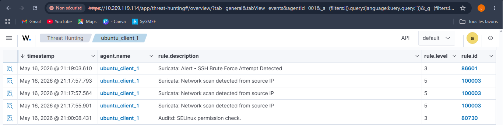
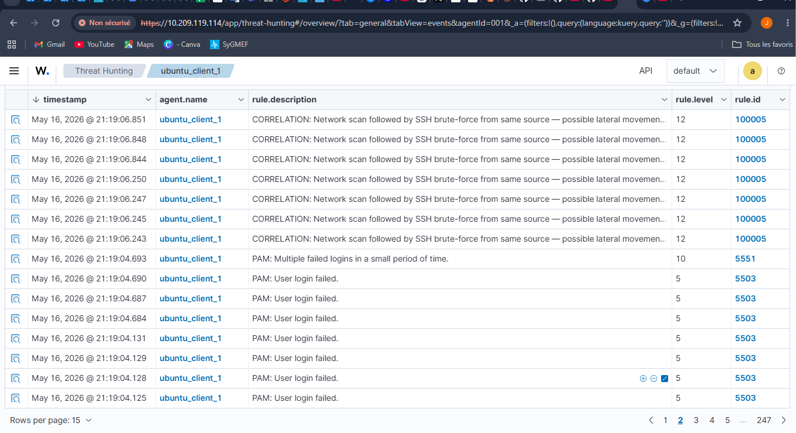
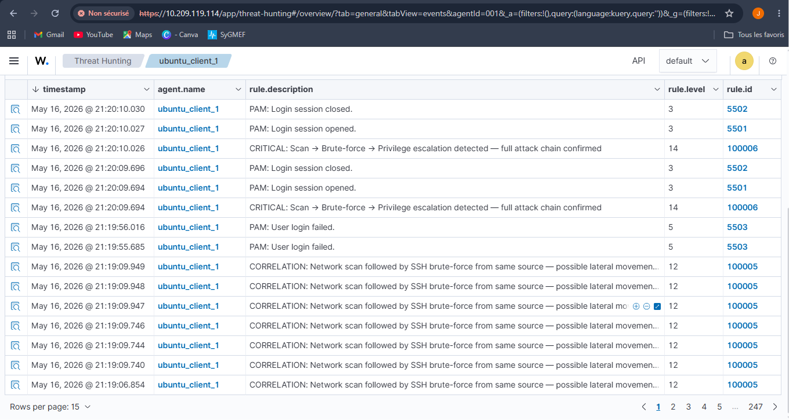
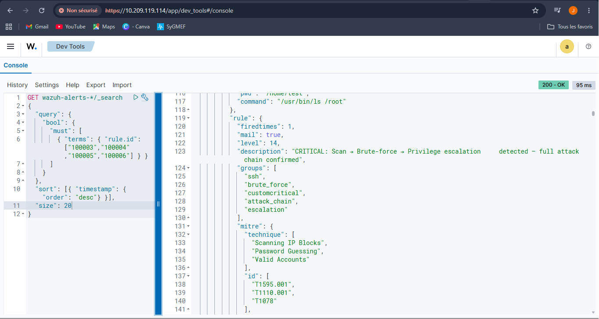

# Month 2 — Project 2.3 : Multi source correlation

**Analyst:** Jean-Mik C. TINIGO
**Date:** May 2026
**Difficulty:** Intermediate
**Tools:** Suricata 8.0.2, Wazuh 4.14, Ubuntu Desktop 24.04, Ubuntu server 22.04

---

## Objective

Several alerts pop up—network scan detected. Two minutes later, SSH login attempts appear from the same IP address. Then, a `sudo` command is executed to root on the target machine. Individually, each event is level 3. Together, it's a complete level 12 attack chain. I'm going to build the rule that makes this correlation.


---

## Lab Architecture

| Component        | Role                       | OS                      | IP             |
|------------------|----------------------------|-------------------------|----------------|
| Ubuntu Desktop VM| Target + IDS + Wazuh agent | Ubuntu 24.04 Desktop    | 10.209.119.127 |
| Ubuntu server VM | Attacker + Wazuh server    | Ubuntu 22.04 Server     | 10.209.119.114 |
| Hypervisor       | Host                       | Oracle VirtualBox 7.2.4 | —              |

Both machines communicate over a VirtualBox **Bridged** internal network.
Ubuntu desktop hosts Suricata (IDS) and wazuh-agent
Ubuntu server hosts Wazuh (SIEM) for alerts managements.

---

## Project Architecture 
```bash
Ubuntu Server (attaquant)
        │
        ▼
   [1] Nmap scan ──────────────► Suricata → eve.json
        │                              │
   [2] SSH brute-force                 ▼
        │                        Wazuh Agent
   [3] Commande sudo                   │
        │                              ▼
        └──────────────────────► Wazuh Manager
                                       │
                              [CORRÉLATION RULE]
                              Si scan + bruteforce
                              détectés = ALERT LVL 12
                                       │
                                       ▼
                               Kibana Dashboard
```

---

## Step 1: Add annother source of logs 
In addition to the logs of Suricata, we'll add `linux authentication logs` as an independent source in Wazuh to have two separate streams to correlate.

`WARNING : DO THIS STEP ON UBUNTU DESKTOP MACHINE`

1. **Install and enable auditd**
Auditd offer a detailed log of all significant actions, primarily for the purpose of meeting compliance requirements and enabling thorough security investigations.
```bash
# These commands install auditd, enable and start it
sudo apt install auditd audispd-plugins -y
sudo systemctl enable auditd
sudo systemctl start auditd
```

2. **Add the files to monitor**
We will configure audit rules to monitor SSH connections and privilege escalations.
```bash
# Survey read (-p r) operation on authentication log file (-w /var/log/auth.log)
sudo auditctl -w /var/log/auth.log -p r -k auth_monitor
# Survey write and attribute changes (-p wa) operations on the user accounts file  
sudo auditctl -w /etc/passwd -p wa -k passwd_changes
# Survey execution (-p x) operation with sudo command, elevation privileges
sudo auditctl -w /usr/bin/sudo -p x -k sudo_usage


# Verify that the rules are active
sudo auditctl -l
```

3. **Add auditd as a source in Wazuh Agent**
We will add another log sources in wazuh for the correlation
```bash
# Open the wazuh agent config file
sudo nano /var/ossec/etc/ossec.conf
```

Then, we wiil add this xml code in `<ossec_config>` section in bottom
```xml
<!-- Source 2 : Authentication logs -->
<localfile>
  <log_format>syslog</log_format>
  <location>/var/log/auth.log</location>
</localfile>

<!-- Source 3 : Audit logs -->
<localfile>
  <log_format>audit</log_format>
  <location>/var/log/audit/audit.log</location>
</localfile>
```

```bash
# Restart the wazuh-agent
sudo systemctl restart wazuh-agent
```

## Step 2: Create correlation rules
This is the heart of the project. We're going to create a Wazuh rule that triggers only when two distinct events occur within a time window.

`WARNING : DO THIS STEP ON UBUNTU SERVER MACHINE`

1. **Add correlation rules in the rules config file**
The location of the local wazuh rules file is `/var/ossec/etc/rules/local_rules.xml`
```bash
# Open the local wazuh rule file 
sudo nano /var/ossec/etc/rules/local_rules.xml
```

Add these rules after the rule 100002
```xml
 <!-- Marquer une IP qui a déclenché un scan Suricata -->
  <rule id="100003" level="5">
    <if_sid>86601</if_sid>
    <match>SCAN</match>
    <description>Suricata: Network scan detected from source IP</description>
    <group>recon,suricata,correlation</group>
  </rule>

  <!-- Marquer un brute-force SSH depuis la même IP -->
  <rule id="100004" level="5">
    <if_sid>5760</if_sid>
    <description>SSH authentication failure — potential brute force</description>
    <group>ssh,bruteforce,correlation</group>
  </rule>

  <!-- CORRÉLATION — scan suivi de brute-force SSH -->
  <rule id="100005" level="12" frequency="2" timeframe="300">
    <if_matched_sid>100003</if_matched_sid>
    <if_sid>100004</if_sid>
    <!-- <same_source_ip /> -->
    <same_agent />
    <description>CORRELATION: Network scan followed by SSH brute-force
    from same source — possible lateral movement attempt</description>
    <mitre>
      <id>T1595.001</id>
      <id>T1110.001</id>
    </mitre>
    <group>correlation,lateral_movement,high_priority</group>
  </rule>

  <!-- Escalade critique — sudo après brute-force -->
  <rule id="100006" level="14" frequency="2" timeframe="600">
    <if_matched_sid>100005</if_matched_sid>
    <if_sid>5402</if_sid>
    <description>CRITICAL: Scan → Brute-force → Privilege escalation
    detected — full attack chain confirmed</description>
    <mitre>
      <id>T1595.001</id>
      <id>T1110.001</id>
      <id>T1078</id>
    </mitre>
    <group>critical,attack_chain,escalation</group>
  </rule>
```

2. **Apply configuration**
Restart Wazuh Manager 
```bash
# Restart wazuh-manager service 
sudo systemctl restart wazuh-manager
# Open wazuh log file in real-time and filter by rule-id "100003-100006"
sudo tail -f /var/ossec/logs/ossec.log | grep -E "10000[3-6]"
```

## Step 3: Simulate the complete attack chain
We will use the ubuntu server machine to lauch attacks on our agent machine (Ubuntu Desktop)
NB: THE ATTACK EXECUTION ORDER IS IMPORTANT !!
```bash
#===========================ON UBUNTU SERVER============================================
# PHASE 1 — Recognition (triggers rule 100003)
sudo nmap -sS -T4 10.209.119.127
```
**Screenshot — Rule 100003 triggered :**


```bash 
# Wait 30 secondes
sleep 30

# PHASE 2 — Brute-force SSH (triggers rule 100004)
# If rule 100003 + 100004 in 300s → trigger rule 100005
hydra -l root -P ./passwords.txt ssh://10.209.119.127 -t 4
```
**Screenshot — Rule 100005 triggered :**


```bash
# PHASE 3 — Privilege escalation simulation
#============================ON UBUNTU DESKTOP===========================================
# On Ubuntu Desktop, execute manually :
sudo ls /root
# (trigger rule 5402 → if rule 100005 active → trigger rule 100006)
```
**Screenshot — Rule 100006 triggered :**


- **Here is the reconstructed attack chain**

| Timeline          | Rule    | Level | Event                     |
|-------------------|---------|-------|---------------------------|
|21:17:55 → 21:17:57| 100003  | 5     | Scan triggered (×3)       |
|21:19:04 → 21:19:06| 100005  | 12    | CORRÉLATION triggered     |
|21:20:09 → 21:20:10| 100006  | 14    | CHAÎNE COMPLÈTE confirmed |

**Note: Rule 100004 does not appear independently — it is absorbed 
by rule 100005 via Wazuh's rule chaining mechanism (see Challenges section).**


## Step 4: Check timeline with OpenSearch DSL
In Wazuh dashboard , go to `Indexer management` and select `Dev Tools` option.
Then paste this JSON Query :
```json
GET wazuh-alerts-*/_search
{
  "query": {
    "bool": {
      "must": [
        { "terms": { "rule.id": ["100003","100004","100005","100006"] } }
      ]
    }
  },
  "sort": [{ "timestamp": { "order": "desc"} }],
  "size": 20
}
```
This OpenSearch DSL Query return the chronological timeline of the attack chain.
**Screenshot — OpenSearch DSL Query & Result :**



---

## Challenges and Lessons learned

- **Rules 100004 and 5402 don't showing up on the dashboard**
Wazuh has a `rule chaining` mechanism — when a child rule is triggered and generates a higher-level alert, the intermediate rules may not appear separately if they are considered to be absorbed into the final rule.
This means that the rules 100004 and 5402 are triggered well (otherwise 100005 and 100006 would never appear), they are just "consumed" by higher-level correlation rules.

- **Rule 100005 is triggered in bursts**
This is normal with frequency="2" — each new occurrence of 100004 in the 300s window re-triggers the correlation rule.

---

## Technical difficulties & Decisions made.

- **same_source_ip tag issues**
In the xml rules, you will notice the commited line ` <!-- <same_source_ip /> -->`. At first this tag is suppose to verify if the ip source adress that triggered the 100003 and 100004 alerts are the same before triggered the 100005 alert. But during the tests this don't work despite the fact that 100003 and 100004 alerts are showing up on the dashboard.
After research, I discovered that the `data.src_ip` field (Suricata JSON field) on 100003 rule and `data.srcip` (Wazuh normalized field) on 100004 rule are two different things in the OpenSearch index, and <same_source_ip /> only compares the srcip (like source ip) field normalized by the decoder.
To solve that, i tried to make my own custom decoder but that's don't work. Indeed the problem is that Wazuh decoders are applied at the time of raw log ingestion, not to JSON fields already parsed by Suricata.
Finally i used the tag `<same_agent />` who verify if the agent from which the alerts were triggered are the same. In my architecture, i only have one agent, and all attacks originate from the same external machine targeting that same agent. Therefore, correlation by agent is functionally equivalent to correlation by IP address in my context.

---

## Resources Used

- [Wazuh Documentation](https://documentation.wazuh.com/current/quickstart.html)


