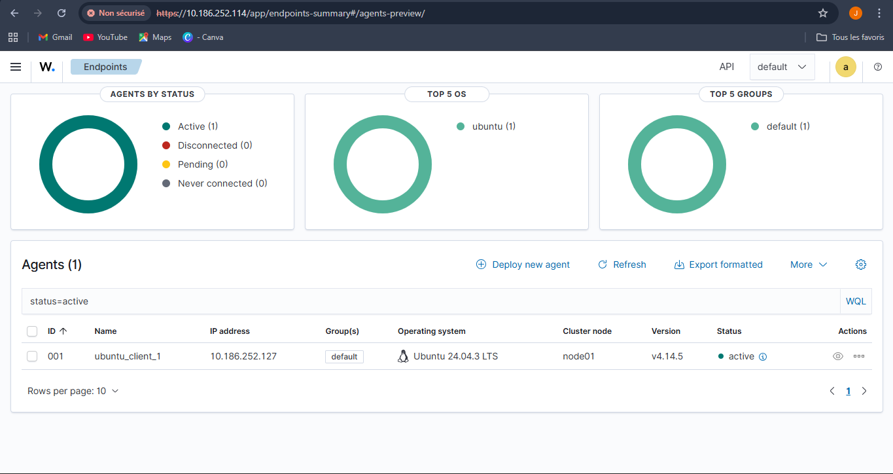
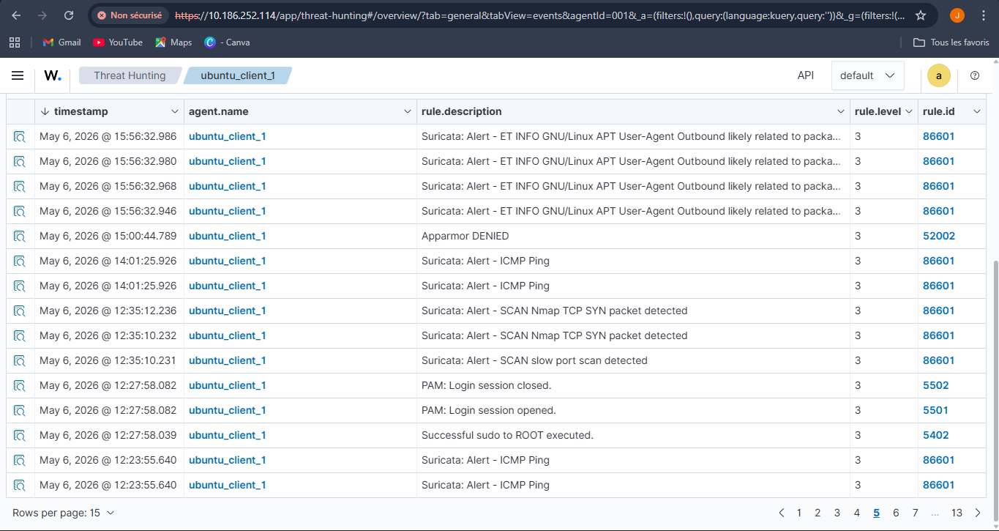
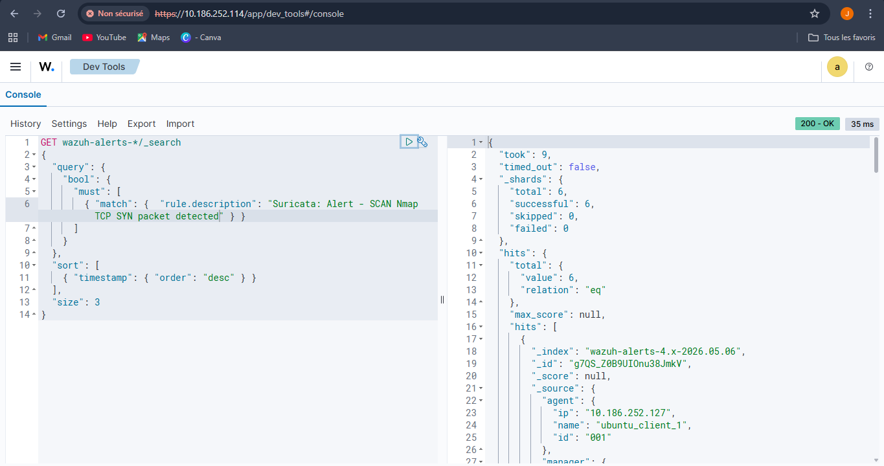

# Month 2 — Project 2.1 : Wazuh deployment + Suricata integration

**Analyst:** Jean-Mik C. TINIGO
**Date:** May 2026
**Difficulty:** Intermediate
**Tools:** Suricata 8.0.2, Wazuh 4.14, Ubuntu Desktop 24.04, Ubuntu server 22.04, Nmap

---

## Objective

An IDS that generates alerts in a local text file has no operational value in a SOC. Everything must be centralized, correlated, and visible on a dashboard. I'm going to industrialize my lab by installing 
Wazuh SIEM from scratch via Bash script.


---

## Lab Architecture

| Component        | Role                       | OS                      | IP             |
|------------------|----------------------------|-------------------------|----------------|
| Ubuntu VM        | Target + IDS + Wazuh agent | Ubuntu 24.04 Desktop    | 10.218.45.127  |
| Ubuntu server VM | Attacker + Wazuh server    | Ubuntu 22.04 Server     | 10.218.45.114  |
| Hypervisor       | Host                       | Oracle VirtualBox 7.2.4 | —              |

Both machines communicate over a VirtualBox **Bridged** internal network.
Ubuntu desktop hosts Suricata (IDS) and wazuh-agent
Ubuntu server hosts Wazuh (SIEM) for alerts managements.

---

## Step 1 : Install Wazuh on Ubuntu Server 22.04

1. **Wazuh installation**
If you want to install it on another OS, check the documentation at the end.
```bash
# bash script that install all wazuh packages
curl -sO https://packages.wazuh.com/4.14/wazuh-install.sh && sudo bash ./wazuh-install.sh -a
```
At the end of the installation, wazuh will display the credentials (User & Password) you will use in the dashboard.

2. **Check Wazuh services state**
Check if the Wazuh services is on :
```bash
# bash script to check wazu-manager service state
sudo systemctl status wazuh-manager
sudo systemctl status wazuh-indexer
sudo systemctl status wazuh-dashboard
```

---

## Step 2: Deploy wazuh-agent on ubuntu desktop

1. **Obtain agent installation link with wazuh dashboard**
- Connect with the wazuh dashboard with the credentials 
- Go to agents management section and click `+ Deploy new agent`
- Fill and select column with the right information  
- You will get a link like this below and paste it to Ubuntu desktop terminal :
```bash
# bash script that install wazuh agent
 wget https://packages.wazuh.com/4.x/apt/pool/main/w/wazuh-agent/wazuh-agent_4.14.5-1_amd64.deb && sudo WAZUH_MANAGER='wazuh_server_ip_address' WAZUH_AGENT_NAME='wazuh_agent_name' dpkg -i ./wazuh-agent_4.14.5-1_amd64.deb
```

2. **Start agent**
```bash
# bash command that enable wazuh-agent and start it
sudo systemctl daemon-reload
sudo systemctl enable wazuh-agent
sudo systemctl start wazuh-agent
```

3. **Check if wazuh-agent is active**
```bash
# bash command that verify wazuh-agent service status
 sudo systemctl status wazuh-agent
```
And go the the wazuh dashboard to see if it's visible , you will see something like this:


4. **Configure the Agent to read Suricata log file eve.json**
- Modify /var/ossec/etc/ossec.conf to allow wazuh to survey *eve.json* log file 
```bash
# bash command that open wazuh-agent config file
sudo nano /var/ossec/etc/ossec.conf
```
- Add this block to the *<ossec_config>* section at the bottom 
```
<localfile>
  <log_format>json</log_format>
  <location>/var/log/suricata/eve.json</location>
  <label key="@source">suricata</label>
</localfile>
```
- Restart the wazuh-manager
```bash
# bash command to restart wazuh agent service 
sudo systemctl restart wazuh-agent
```

## Step 3: Simulate Attack and visualize wazuh detection

1. **Run scan commands**
On Ubuntu server terminal, run a SYN scan:
```bash
ping <target-ip>

nmap -sS -T4 <target-ip>
```
`-sS`: SYN scan

`-T4`: Faster scan timing

This scan should trigger Suricata detection rules for port scanning. The local.rules we 
customed in `M-1-suricata` will detect the scan.

2. **View Alerts in Wazuh Dashboard**
Login to Wazuh Dashboard.

Navigate to Threat Hunting → Events.

Filter by Rule Group: Suricata

**Screenshot — Threat Hunting Dashboard :**

Alerts visible at 12:35:10 UTC confirm Suricata rules SID 1000002 
and SID 1000003 were triggered by the Nmap scan from 10.218.45.114.

---

## Observations

1. **OpenSearch JSON**
I used an OpenSearch DSL query to filter Suricata alerts in order to prove the raw feed of Suricata alerts in the search engine. For that i used the OpenSearch Dev Tools interface (Wazuh Indexer) to run a DSL query filtering a specific alert.
This is the DSL query :
```json
GET wazuh-alerts-*/_search
{
  "query": {
    "bool": {
      "must": [
        { "match": { "rule.description": "Suricata: Alert - SCAN Nmap TCP SYN packet detected" } }
      ]
    }
  },
  "sort": [
    { "timestamp": { "order": "desc" } }
  ],
  "size": 3
}
```
*Query explanation*
|Element                     |Role|
|----------------------------|----|
|wazuh-alerts-*              |Query all Wazuh alert indexes (including those created daily) |
|query → bool → must         |The following conditions must all be true|
|match on rule.description   |Search for the described Nmap TCP SYN alert|
|sort by timestamp desc      |Sort the results from newest to oldest|
|size: 3                     |Limit the display to the last 3 alerts|

**Screenshot — Raw JSON OpenSearch Response :**

Here we can see specifics fiels like :
- _index: wazuh-alerts-4.x-2026.05.06
- agent.name: ubuntu_client_1
- rule.description who corresponds to the Nmap alert.

This demonstrates the successful ingestion of Suricata alerts by the Wazuh Indexer.

2. **Threat Hunting Alerts**
In the `threat_hunting_alerts` screenshot, we can see `PAM(Login session opened/closed)`,
`Successful sudo to ROOT executed` and `Apparmor DENIED` alerts in addition to suricata alerts. That's means beyond Suricata alerts, Wazuh automatically detected system-level events (PAM logins, sudo executions, Apparmor access) from native Linux logs — demonstrating SIEM correlation across multiple log sources without additional configuration.

3. **Emerging Threats rules firing automatically**
At 15:56 UTC, `Suricata triggered ET INFO rules detecting APT package manager outbound traffic` — confirming that Emerging Threats ruleset loaded during Month 1 is actively monitored through the full 
Suricata → Wazuh pipeline.

---

## Challenges & Lessons Learned

- Permissions for /etc/netplan/00-installer-config.yaml are too open —
  modify with chmod command to *600* for fixing the ubuntu machines IP address
- Unable to connect to '[10.186.252.114]:1514/tcp': 'Transport endpoint is not connected' - 
    active ufw on the wazuh-server & wazuh-agent and add rule to allow this port `sudo ufw allow 1514/tcp`
    after analyzing raw packets with `sudo tail -f /var/ossec/logs/ossec.log`
- Wazuh server on ubuntu server refuse connection to the dashboard - 
    add ufw rule to allow https connection to the host `sudo ufw allow 443/tcp`

---

## MITRE ATT&CK Coverage

| Technique ID | Name | Detection |
|---|---|---|
| T1595.001 | Active Scanning | Suricata alert visible in Wazuh — rule.id 86601 |

---

## Resources Used

- [Wazuh Documentation](https://documentation.wazuh.com/current/quickstart.html)
