# Month 3 — Project 3.3 : Memory Forensics with Volatility

**Analyst:** Jean Mik C. TINIGO
**Date:** July 2026
**Difficulty:** Intermediate
**Tools:** Ubuntu Desktop 22.04, Volatility2

---

## Context & Objective
Malware has just been detected on a Windows machine. The machine is immediately isolated from the network.
We just received a ram dump file from the infected host to investigate.
Here is the context from the lab we use on MemLabs :
My sister's computer crashed. We were very fortunate to recover this memory dump. Your job is get all her important files from the system. From what we remember, we suddenly saw a black window pop up with some thing being executed. When the crash happened, she was trying to draw something. Thats all we remember from the time of crash.

Note: `This challenge is composed of 3 flags.`

---

## Lab Architecture

| Component        | Role                        | OS                      | IP             |Resources|
|------------------|-----------------------------|-------------------------|----------------|---------|
| Ubuntu Desktop VM| Volatility2 + Investigator  | Ubuntu 24.04 Desktop    | 10.72.41.127 |5GB of RAM; 3 cores|
| Hypervisor       | Host                        | Oracle VirtualBox 7.2.4 | -              |-|

---

## Installation of Volatility and python2

1. Install python2 manually if it's doesn't already install in your system. 
```bash
sudo apt update
sudo apt install -y build-essential checkinstall libncurses-dev libssl-dev libsqlite3-dev tk-dev libgdbm-dev libc6-dev libbz2-dev libffi-dev libreadline-dev libdb-dev

cd /usr/src
sudo wget https://www.python.org/ftp/python/2.7.18/Python-2.7.18.tgz
sudo tar xzf Python-2.7.18.tgz
cd Python-2.7.18

sudo ./configure --enable-optimizations --prefix=/usr/local/python2.7
sudo make
sudo make install

echo 'export PATH="/usr/local/python2.7/bin:$PATH"' >> ~/.bashrc
source ~/.bashrc

curl https://bootstrap.pypa.io/pip/2.7/get-pip.py -o get-pip.py
sudo python2.7 get-pip.py
```

2. Install volatility2 and get into his directory
```bash
git clone https://github.com/volatilityfoundation/volatility.git
cd volatility
```

3. Verify the installation by display volatility command menu
```bash
python2.7 vol.py -h
```
**Screenshot - Volatility menu**

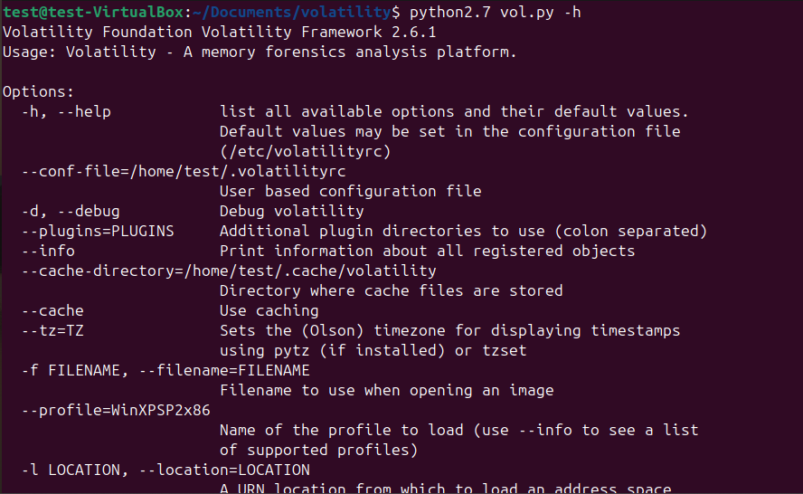
---

## Memory Dump Analysis

**Initial Throughts**

From the description or context, we can identifying some clues such as :
- She has important files from the system (Maybe these files will give us some information)
- They see a black window pop up with some thing being executed (apparently the terminal is involved)
- She was drawing when the computer crashed (Gotta investigate on the drawing application)

Now let start analyzing the memory dump.

**Identifying the system in the dump file and select a profile**

First of all, we give a quick verfication on the ".raw" file to see his type.

**Screenshot - dump file type**

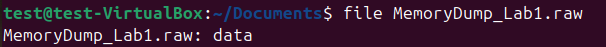

The dump file type is a data. Not some big information but still a good practice i think.
Now we'll use the "imageinfo" plugins to get some basics information about the system of the dump file like the OS, the profiles, image datetime and others.

**Screenshot - imageinfo**

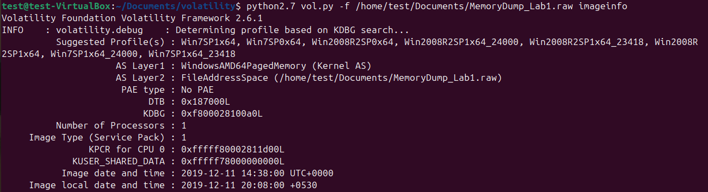

So the system we are using is a Windows 7 (64 bit) with eight (8) profiles we can select for further investigation. 

**What reveal the processes ?**

We have to understand what happens in the system by looking for the running processes, check the hidden ones and display the process tree if needed. For that we'll use that command :
```bash
python2.7 vol.py -f /home/test/Documents/MemoryDump_Lab1.raw --profile=Win7SP1x64 pslist
# return for all running processes on the system 
python2.7 vol.py -f /home/test/Documents/MemoryDump_Lab1.raw --profile=Win7SP1x64 psscan
# return all hidden processes 
python2.7 vol.py -f /home/test/Documents/MemoryDump_Lab1.raw --profile=Win7SP1x64 pstree
# display the process tree 
```
Any process appearing in psscan but not in pslist is suspicious it may indicate a rootkit attempting to hide itself.

**Screenshot - Hidden processes**

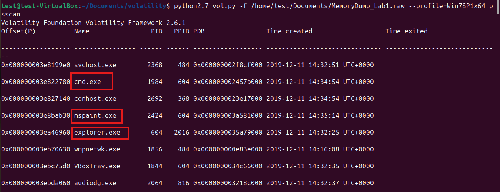

We got here three suspect processes :
- **explorer.exe :** Remenber me of the Important files we has to recover (maybe it's useless but we'll see)
- **cmd.exe :** They saw a black window pop up when the crashed 
- **mspaint.exe :** She was drawing when the crash happen


**Did the executed command are suspicious ?**
Let's verify the command line argument to see if they are something to tell 
```bash
python2.7 vol.py -f /home/test/Documents/MemoryDump_Lab1.raw --profile=Win7SP1x64 cmdline
# return process command-line arguments
```
It seem, we got something interesting from there :

**Screenshot - WinRAR command line**

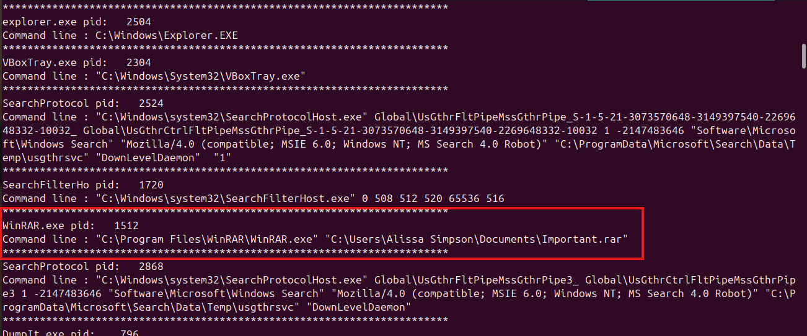

From this we got :
- The sister name : `Alissa Simpsons`
- The Important file we are looking for. 
She apparently compressed the important files using WinRAR.exe. So now, we have to get more information about that files.

**What can we get from that files ?**
First of all, we'll scan all files on the system to get more information about them 
```bash
python2.7 vol.py -f /home/test/Documents/MemoryDump_Lab1.raw --profile=Win7SP1x64 filescan | tee filescan_result.txt
# return information about every file on the system
```
There's a lot of file in the system, so i redirect the output of the command of a txt file. We can filter the information we went efficiently from that file. By searching the important file name `Important.rar` from the output txt file with this command `grep -i "important.rar" filescan_result.txt `, we get this : 

**Screenshot - Filescan output filter**

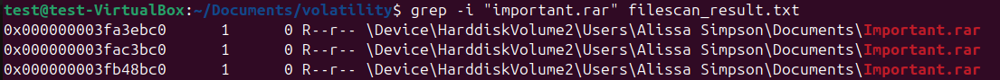

We can see three instances of this file with different offset. Let's try to extract the file by using the offset as a identification key with the `dumpfiles` plugin. We start with the first one : 
```bash
python2.7 vol.py -f /home/test/Documents/MemoryDump_Lab1.raw --profile=Win7SP1x64 dumpfiles -D . -Q 0x000000003fa3ebc0 -n
# -D : to index the directory ( . mean the actual one)
# -Q : to index the offset we wanna use 
# -n : to include the original filename on the output
```

***Screenshot - Dumpfiles on the RAR file*

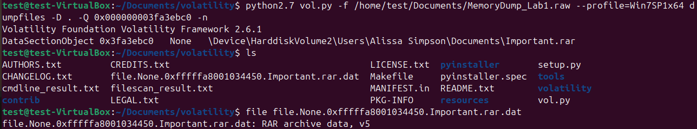

Like we can see, we extract the file and check his type. It's effectivily a RAR file so we gonna extract it to see what files it's containt with this unrar command `unrar e file.None.0xfffffa8001034450.Important.rar.dat` 

**Screenshot - Unrar first result**

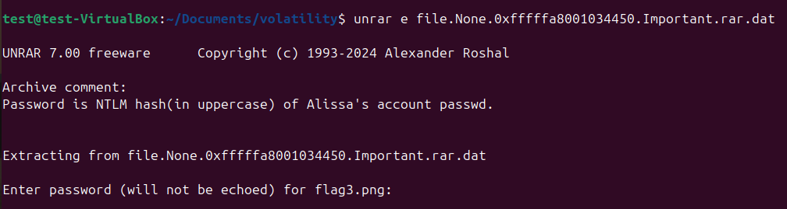

`Password is NTLM hash(in uppercase) of Alissa's account passwd.`

A NTLM hash is the one-way hash (the mathematical transformation) of user password . Windows stores this hash instead of the plaintext password for security reasons.
Volatility2 plugin `hashdump` allow us to dumps passwords hashes (LM/NTLM) from memory. 

**Screenshot - Hashdump plugin**

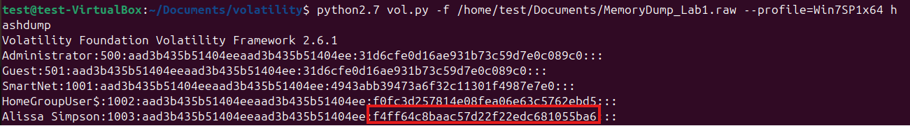

Now we'll put in in uppercase using python upper fonction like this :

**Screenshot - NTLM hash in uppercase**

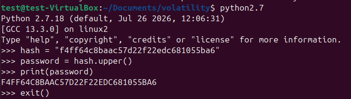

Now we can use it to decompress our file. 

**Screenshot - Unrar final result**

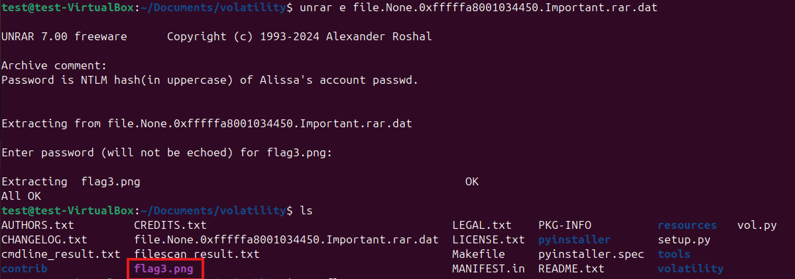

we got a png file that show us one of the third flag we are searching for the lab.

**Screenshot - 3rd Flag**

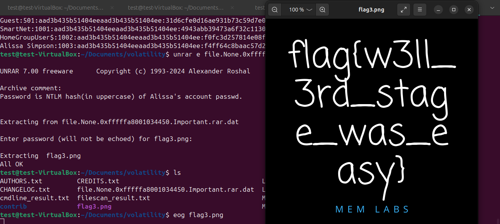

Let's store it for later.

Before moving for the drawing application process, let's check if the command line are nothing more to reveal us whis the `cmdscan` plugin that display the command history.

**Screenshot - cmdscan result**

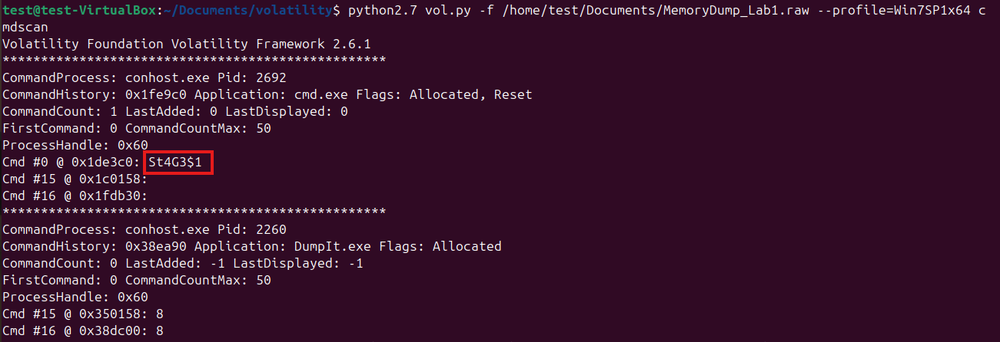

We got somethong interesting here that look like `Stage1`. 
So our next step would be check if this command sent any output to stdout. For this, we use the `consoles` plugin.

**Screenshot - consoles result**

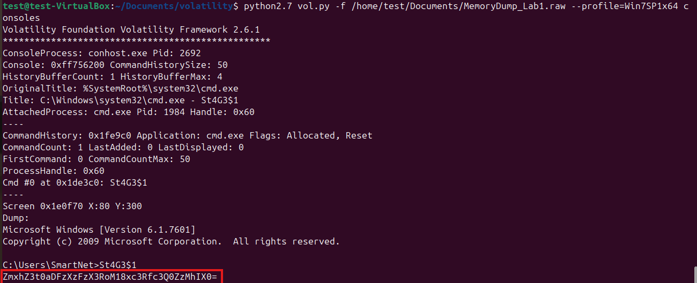

This look like en encoded string. So i tried to decode it in `bas64` to see what happen and IT WORKS !!

**Screenshot - Base64 decode**

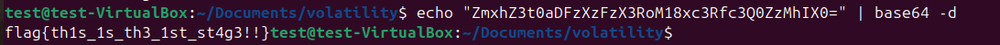

Here it our second flag but it's seem like it's supposed to be the first one. Anyways we got another flag, now only one left. 

**Did the drawing application has something to show us ?**

Let's get back to the `mspaint.exe` process. Now i filter on my pstree plugin result txt file to search for some information about it. The result is this : 

**Screenshot - Drawing app process information**

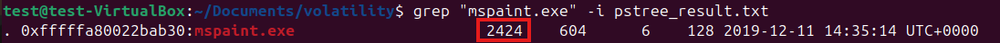

This process ID will be used by the memdump plugins to dump the addressable memory for a process. Then i extract some data type file but it's on `.dmp` extension. So i copy the file to change his extension to `.data` and open it with `gimp`.

**Screenshot - Memdump process result**

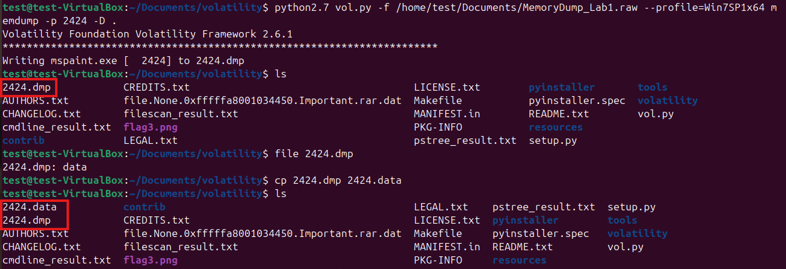

I visualize the `2424.data` file with gimp on `Aplha RGB` mode and after a couple of manipulation, i found this : 


**Screenshot - GIMP result**

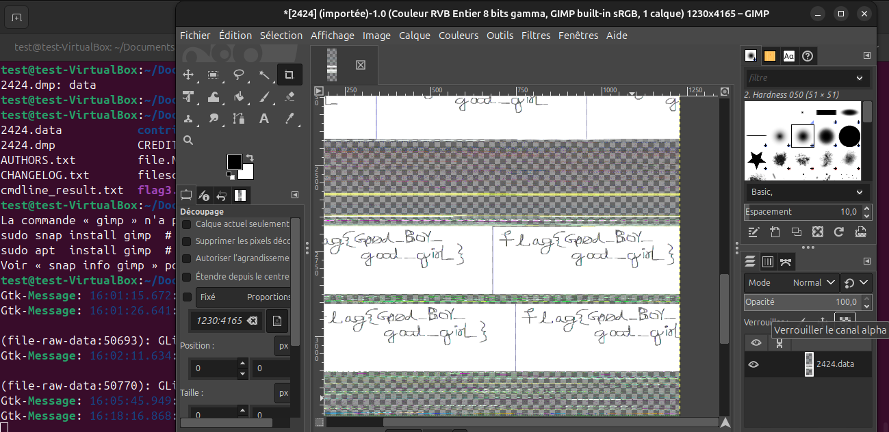

Here we got it, our last flag. 3/3 flag completed !!!

FLAGS : 
- flag{th1s_1s_th3_1st_st4g3!!}
- flag{G00d_BoY_good_girl_}
- flag{w3ll_3rd_stage_was_easy}

## MITRE ATT&CK Coverage

| Technique ID | Name | Evidence in lab |
|---|---|---|
| T1059.003 | Command and Scripting Interpreter: Windows Command Shell | cmd.exe found in psscan, command executed visible via cmdscan |
| T1560.001 | Archive Collected Data: Archive via Utility | WinRAR used to compress Important files, visible in cmdline plugin |
| T1003.001 | OS Credential Dumping: LSASS Memory | NTLM hash extracted via hashdump plugin |
| T1027 | Obfuscated Files or Information | Base64-encoded string found in console output, decoded to reveal flag |
| T1005 | Data from Local System | Important files collected and archived by attacker |

---

## Challenges and Lessons Learned

- **Volatilit3 are less functionnal plugins than Volatility2 :**
At first, i start using volatility3 for this lab but i realize while investigate that some plugins are missing pretending volatility3 don't allow them. Si i switch on volatility2 that allow me to get access to all plugins i need for my investigation.

- **Some dependencies are missing (pycryptodome & distorm3) :**
After installing volatility2 and check for the menu i discover that some plugins doesn't install because soem dependencies are missing in python2.7. The dependencies are `pycryptodome & distorm3`, then i install them to get full plugins.

- **Python3 doen't allow me to install the missing dependencies :**
While using Volatility3, i realize some dependencies are missing due to more than ten (10) plugins that can't install. So i tried to install them manually but the system display an error because Debian/Ubuntu add some safety features in their newest versions to to prevent you from accidentally breaking your system's Python environment by installing new packages globally. 
So i create a virtual environment on volatility3 directory i'm working in.
```bash
    cd /home/test/Documents/volatility3
    python3 -m venv venv
    source venv/bin/activate
```
But finally i don't use it for the lab, i switch on volatility2.

---


## Resources Used

- [MemLabs Lab 1](https://github.com/stuxnet999/MemLabs)
- [MITRE ATT&CK](https://attack.mitre.org)
- [Volatility2](https://github.com/volatilityfoundation/volatility.git)
- [VirtualBox Guest Additions](https://download.virtualbox.org/virtualbox/7.2.4)
