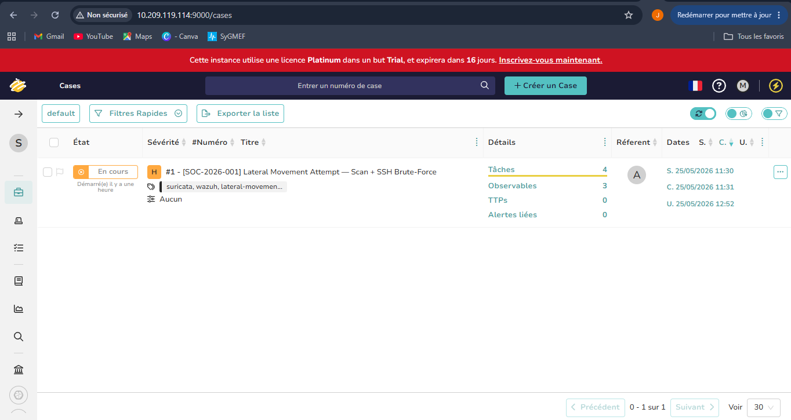
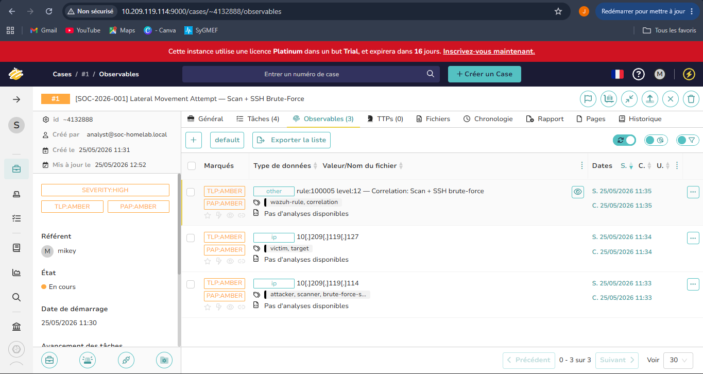
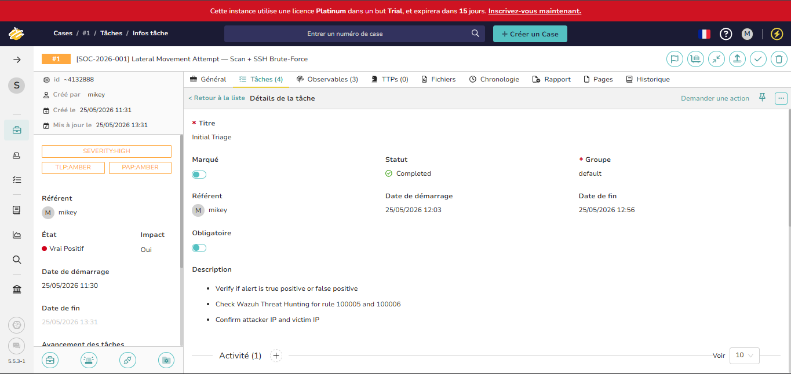
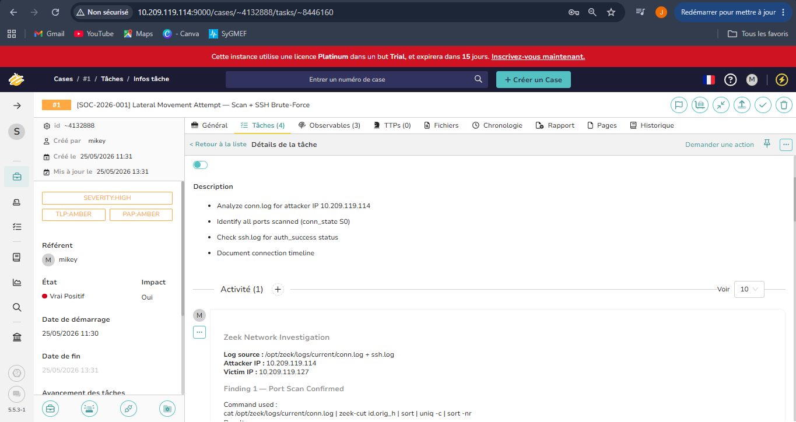
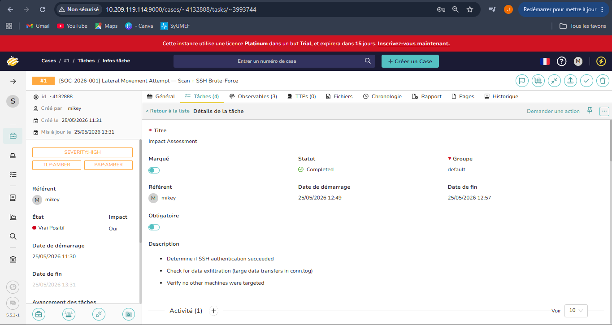
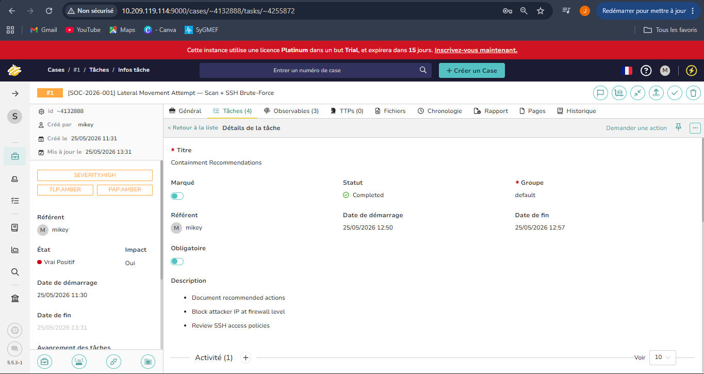
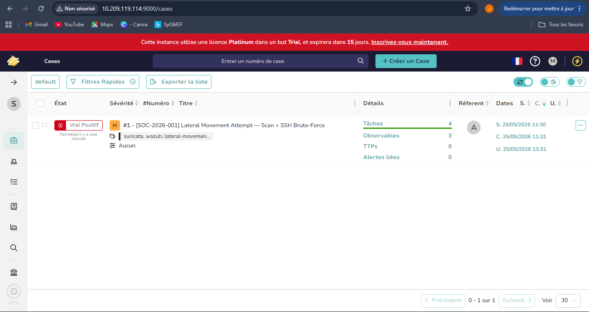

# Month 3 — Project 3.2 : TheHive — Incident Management

**Analyst:** Jean-Mik C. TINIGO
**Date:** May 2026
**Difficulty:** Intermediate
**Tools:** TheHive 5.5, Wazuh 4.14, Zeek 8.2.0, Ubuntu Server 22.04, Java 11.0.31, Cassandra 4.1.11, Elasticsearch 7.17.29

---

## Objective

After Wazuh raises a level 12 correlation alert confirming a network scan followed by an SSH brute-force attack, the next step is not just detecting the threat — it's **managing it**.

This project implements the full SOC incident lifecycle using TheHive:
case creation, triage, investigation tasks, evidence attachment, and formal case closure with a written summary — exactly as an L1/L2 analyst would handle it in a real Security Operations Center.

---

## Lab Architecture

| Component        | Role                        | OS                      | IP             |Resources|
|------------------|-----------------------------|-------------------------|----------------|---------|
| Ubuntu Desktop VM| Target + IDS + Wazuh Agent  | Ubuntu 24.04 Desktop    | 10.209.119.127 |5GB of RAM; 3 cores|
| Ubuntu Server VM | Attacker + Wazuh + TheHive  | Ubuntu 22.04 Server     | 10.209.119.114 |8GB of RAM; 3 cores|
| Hypervisor       | Host                        | Oracle VirtualBox 7.2.4 | -              |-|

---

## SOC Workflow — L1 / L2 / L3 Responsibilities

Before diving into the case, here is how responsibilities are divided in a real SOC for this type of incident :

```
Wazuh alert level 12 triggered
        |
        ▼
L1 Analyst
  - Creates the case in TheHive
  - Performs initial triage (true positive / false positive ?)
  - Attaches IOCs and evidence
  - Escalates to L2 if confirmed true positive
        |
        ▼
L2 Analyst
  - Opens investigation tasks
  - Runs Zeek log analysis
  - Assesses impact (exfiltration? lateral movement?)
  - Documents all findings in task logs
  - Writes closure summary
        |
        ▼
L3 / SOC Manager
  - Reviews findings
  - Validates conclusions
  - Decides containment actions (IP block, machine isolation...)
  - Closes the case officially
```

In this lab, all three roles were performed by me to demonstrate the full workflow end-to-end.

---

## Installation

TheHive requires Java and Cassandra on Ubuntu Server 22.04 before it can start. 
```bash
# Java prerequisites
sudo apt install -y wget gnupg apt-transport-https

# Install Java 11
wget -qO- https://apt.corretto.aws/corretto.key | \
  sudo gpg --dearmor -o /usr/share/keyrings/corretto.gpg
echo "deb [signed-by=/usr/share/keyrings/corretto.gpg] \
  https://apt.corretto.aws stable main" | \
  sudo tee /etc/apt/sources.list.d/corretto.list
sudo apt update && sudo apt install -y java-11-amazon-corretto-jdk

# Display Java version
java -version

# Cassandra (TheHive database)
wget -qO- https://downloads.apache.org/cassandra/KEYS | \
  sudo gpg --dearmor -o /usr/share/keyrings/cassandra-archive.gpg
echo "deb [signed-by=/usr/share/keyrings/cassandra-archive.gpg] \
  https://debian.cassandra.apache.org 40x main" | \
  sudo tee /etc/apt/sources.list.d/cassandra.sources.list
sudo apt update && sudo apt install -y cassandra

sudo systemctl enable cassandra
sudo systemctl start cassandra
sudo systemctl status cassandra

# TheHive - this is an automatic script installation - select option 2 for installation
 wget -q -O /tmp/install_script.sh https://scripts.download.strangebee.com/latest/sh/install_script.sh ; sudo -v ; bash /tmp/install_script.sh

```

Access the dashboard :
```
URL      : http://10.209.119.114:9000
Login    : admin@thehive.local
Password : secret
```

**Organization and user setup :**
```
Organization : SOC-HomeLab
User login   : analyst@soc-homelab.local
Profile      : analyst
Password     : secret@.local
```

---

## Case Creation — SOC-2026-001

The case was created based on the Wazuh level 12 alert from Project 2.3 (multi-source correlation).

**Case details :**

| Field       | Value |
|-------------|-------|
| Case ID     | SOC-2026-001 |
| Title       | Lateral Movement Attempt — Scan + SSH Brute-Force |
| Date        | 16 May 2026 |
| Severity    | High (3) |
| TLP         | TLP:AMBER |
| PAP         | PAP:AMBER |
| Tags        | suricata, wazuh, lateral-movement, ssh, brute-force |

**Summary :**
Wazuh correlation rule 100005 (level 12) triggered at 21:17 UTC. Network scan followed by SSH brute-force detected from 10.209.119.114 targeting 10.209.119.127. Full attack chain confirmed (rule 100006,
level 14) at 21:20 UTC. Investigation required.

**Screenshot — Case Overview :**


---

## Observables (IOCs)

Three observables were attached to the case :

| Type   | Value | Tags | TLP |
|--------|-------|------|-----|
| ip     | 10.209.119.114 | attacker, scanner, brute-force-source | TLP:AMBER |
| ip     | 10.209.119.127 | victim, target | TLP:AMBER |
| other  | rule:100005 level:12 — Correlation: Scan + SSH brute-force | wazuh-rule, correlation | TLP:AMBER |

**Screenshot — Observables :**


---

## Investigation Tasks

Four tasks were created and completed to cover the full investigation lifecycle.

---

### Task 1 — Initial Triage

**Objective :** Determine if the alert is a true positive or false positive.

**Log entry :**
```
Triage Result : TRUE POSITIVE

Verification method : Wazuh Threat Hunting dashboard

Evidence :
- Rule 100003 (level 5) triggered at 21:17:55 UTC
  Description : "Suricata: Network scan detected from source IP"
  Source : Suricata eve.json via Wazuh Agent

- Rule 100005 (level 12) triggered at 21:19:06 UTC
  Description : "CORRELATION: Network scan followed by SSH brute-force"
  Trigger : if_matched_sid 100003 + if_sid 100004 within 300s

- Rule 100006 (level 14) triggered at 21:20:10 UTC
  Description : "CRITICAL: Scan → Brute-force → Privilege escalation"
  Full attack chain confirmed.

Verdict : TRUE POSITIVE — Escalating to L2 investigation.
```

**Screenshot — Task 1 Log :**


---

### Task 2 — Network Investigation (Zeek)

**Objective :** Analyze Zeek logs to understand exactly what happened on the network.

**Log entry :**
```
Zeek Log Source : /opt/zeek/logs/current/conn.log + ssh.log
Attacker IP     : 10.209.119.114
Victim IP       : 10.209.119.127

--- Finding 1 — Port Scan Confirmed ---------------------------
Command :
cat /opt/zeek/logs/current/conn.log | zeek-cut id.orig_h | sort | uniq -c | sort -nr

Result :
- 10.209.119.114 → 2009 connections (highest volume — attacker)
- 10.209.119.127 → 267 connections (victim — normal traffic)
- 2009 connections from single external IP = aggressive scan

Command :
cat /opt/zeek/logs/current/conn.log | zeek-cut id.orig_h id.resp_p conn_state
  | grep "10.209.119.114" | sort -k2 -n | head -30

Result : [see attached: scan_mapping.png]
- Multiple S0 conn_states across various ports
- S0 = SYN sent, no response = port closed or filtered
- Confirms Nmap SYN scan (-sS -T4)

MITRE : T1595.002 — Active Scanning: Port Scanning

--- Finding 2 — SSH Brute-Force Confirmed ------------------------
Command :
cat /opt/zeek/logs/current/ssh.log | zeek-cut ts id.orig_h id.resp_h auth_success

Result : [see attached: successfull_ssh_connections.png]
- 5 SSH connection attempts from 10.209.119.114
- auth_success: false on all attempts
- SSH brute-force FAILED — no access gained
- Tool: Hydra (burst connection pattern)

MITRE : T1110.001 — Brute Force: Password Guessing

--- Finding 3 — Connection State Analysis --------------------
Command :
cat /opt/zeek/logs/current/conn.log | zeek-cut conn_state | sort | uniq -c | sort -nr

Result :
S0    : 2028  ← scan signature (SYN no response)
OTH   : 729   ← abnormal traffic, improper termination
SHR   : 57    ← reset by responder
RSTRH : 7     ← reset from responder
RSTOS0: 5     ← reset with no response
RSTO  : 3     ← reset from origin
SH    : 5     ← semi-open connection

Failed  (S0 + RSTRH + RSTOS0 + RSTO) = 2043
Semi-open (SH + SHR) = 62
- Ratio confirms active port scan, majority of ports closed or filtered.

--- Finding 4 — Attack Timeline -------------------------------
Command :
cat /opt/zeek/logs/current/conn.log | zeek-cut ts id.orig_h id.resp_p conn_state
  | grep "10.209.119.114" | sort -k1 | head -30

Result : [see attached: complete_timeline_attack.png]

Timeline :
21:17:55  First scan packet        conn_state: S0
21:17:57  Last scan packet         conn_state: S0
21:19:04  SSH brute-force begins   conn_state: SH/S0
21:19:06  Last SSH attempt         conn_state: SH
21:20:09  sudo execution on victim (Wazuh rule 5402)

Total connections from attacker : 2009
Total attack duration : ~2 minutes 15 seconds
```

**Screenshot — Task 2 Log :**


---

### Task 3 — Impact Assessment

**Objective :** Determine the actual impact of the attack.

**Log entry :**
```
--- Data Exfiltration Check -----------------------------------
Command :
cat /opt/zeek/logs/current/conn.log | zeek-cut ts id.orig_h id.resp_p duration
  | awk '$4 > 1' | sort -k4 -rn | head -10

Result :
- 10.209.119.127 - multiple HTTPS (443) sessions, 170–299 seconds
  - Legitimate background traffic (updates, cloud sync)
- NO large transfers from attacker IP 10.209.119.114
- Longest attacker session : SSH attempts ~3.5 seconds max

- No evidence of data exfiltration detected.

--- SSH Authentication Result ---------------------------------
Command :
cat /opt/zeek/logs/current/ssh.log | zeek-cut ts id.orig_h id.resp_h auth_success

Result : [see attached: successfull_ssh_connections.png]
- auth_success: false on all attempts from 10.209.119.114
- Attacker did NOT gain SSH access

--- Lateral Movement Check -------------------------------------
Command :
cat /opt/zeek/logs/current/conn.log | zeek-cut id.orig_h | sort | uniq -c | sort -nr

Result :
- Only ONE victim IP identified : 10.209.119.127
- No other internal IPs targeted by 10.209.119.114
- No lateral movement detected

--- DNS Reconnaissance Check ----------------------------------
Command :
cat /opt/zeek/logs/current/dns.log | zeek-cut ts id.orig_h query answers

Result : [see attached: dns_answers.png]
- No suspicious domains queried by attacker IP
- No DGA patterns, no suspicious TLDs (.xyz, .cc, .me)
- DNS not used as attack vector

--- Privilege Escalation --------------------------------------
Source : Wazuh rule 5402 at 21:20:09 UTC
- "Successful sudo to ROOT executed" on victim machine
- Triggered correlation rule 100006 (level 14)
- Part of controlled lab simulation

--- Impact Summary ---------------------------------------------

| Factor               | Status                          |
|----------------------|---------------------------------|
| SSH access gained    | ❌ No — auth_success: false     |
| Data exfiltration    | ❌ None detected                |
| Lateral movement     | ❌ None — single machine only   |
| Privilege escalation | ⚠️ sudo executed (lab sim)      |
| DNS abuse            | ❌ None detected                |

- Impact Level : MEDIUM
- Full attack chain confirmed but no breach achieved
- In production : level 14 alert requires immediate containment regardless of SSH authentication result
```

**Screenshot — Task 3 Log :**


---

### Task 4 — Containment Recommendations

**Objective :** Document recommended actions for L3/SOC Manager.

**Log entry :**
```
--- Immediate Actions (within 1 hour) ------------------------
1. BLOCK attacker IP at firewall level
   sudo ufw deny from 10.209.119.114 to any
   sudo ufw reload

2. REVIEW active SSH sessions on victim machine
   who
   last -n 20
   ss -tnp | grep :22

--- Short-term Actions (within 24 hours) ---------------------
3. RESTRICT SSH access to known IPs only
   Edit /etc/ssh/sshd_config :
   - AllowUsers user@10.209.119.0/24
   - PasswordAuthentication no (enforce SSH key auth)
   sudo systemctl restart sshd

4. DEPLOY fail2ban for automatic SSH blocking
   sudo apt install fail2ban -y
   - Blocks IP after 5 failed attempts within 10 minutes

5. AUDIT sudo usage on victim machine
   grep "sudo" /var/log/auth.log | tail -20

--- Detection Improvement -----------------------------------
6. Add Wazuh rule to alert on successful SSH from unknown IPs
7. Reduce correlation timeframe from 300s to 120s
   to detect faster attack chains
8. Resolve <same_source_ip /> limitation in correlation rules
   by implementing proper field normalization for Suricata
   JSON fields in Wazuh decoder

--- Lessons Learned ----------------------------------------
Multi-source correlation (Suricata + auth.log) was essential.
Single-source monitoring would have missed the full chain.
TheHive provided structured documentation that would allow
any analyst to pick up the investigation at any stage.
```

**Screenshot — Task 4 Log :**


---

## Case Closure

After completing all four tasks, the case was formally closed with the following summary :

**Case Status :** Resolved - TRUE POSITIVE
**Resolution :** Attack chain confirmed, no breach achieved

**Final Summary :**
```
Incident SOC-2026-001 - CLOSED

Attack confirmed : Network scan + SSH brute-force + sudo escalation
Attacker IP      : 10.209.119.114
Victim IP        : 10.209.119.127
Duration         : 21:17:55 → 21:20:10 UTC (2m15s)

Wazuh correlation rules fired in sequence :
100003 (level 5)  -> Scan detected
100005 (level 12) -> Correlation: Scan + Brute-force
100006 (level 14) -> Full chain: Scan + Brute-force + Escalation

Zeek investigation confirmed :
- 2028 S0 conn_states = aggressive port scan
- 5 SSH attempts, auth_success: false = brute-force failed
- No exfiltration, no lateral movement detected

Impact : MEDIUM
The attacker executed a full attack chain but did not gain access to the target machine. Immediate firewall block of 10.209.119.114 recommended.
```

**Screenshot — Closed Case :**


---

## MITRE ATT&CK Coverage

| Technique ID | Name | Evidence |
|---|---|---|
| T1595.002 | Active Scanning: Port Scanning | 2028× S0 conn_state in Zeek |
| T1110.001 | Brute Force: Password Guessing | ssh.log auth_success: false |
| T1078 | Valid Accounts (attempted) | SSH targeting valid user accounts |
|T1548.003 | Abuse Elevation Control Mechanism: Sudo and Sudo Caching | sudo execution - Wazuh rule 5402 |

---

## Challenges and Lessons Learned

- **Archived Github Repository**
The official TheHive installation based on github repository is what i tried first. But to my suprise the `wget` command can't reach the repository URL. After research, i discover that the repository was archived on `Dec 5 2025` in `read-only` mode. By reading the `README` file, i found the `URL` leading to the current documentation for installing TheHive.

- **Automatic installation go wrong**
At the end of TheHive automatic script installation, an error occured that says TheHive can't start. After verify requires services status, i found that `elasticsearch and theHive services can't start properly`. So i verify the system logs and found that `Elasticsearch fails to start due to insufficient memory (OOM Killer)`. To correct this, i turn off my Ubuntu server virtual machine, add more system resources and restart it. These resources have gone from (2 cores & 4GB de RAM) to (3 cores & 8GB de RAM). 
To allow my host machine to support the simultaneous startup of both machines, I reduced the resources of my Ubuntu Desktop virtual machine by going from (3 cores & 8GB de RAM) to (3 cores & 5GB de RAM). 

- **TLP and PAP fields**
TLP (Traffic Light Protocol) and PAP (Permissible Actions Protocol) are standard classification schemes used in SOC environments.
TLP:AMBER = restricted sharing within organization.
PAP:AMBER = can be used for detection but not for active response without authorization. 
Understanding these is essential for handling real incident cases professionally.

- **TheHive Observables vs Tasks**
Observables = the evidence artifacts (IPs, hashes, domains, URLs) that characterize the threat and can be enriched with external threat intelligence platforms (MISP, VirusTotal).
Tasks = the actions and investigations performed by analysts to handle the incident. Both are necessary: Observables define WHAT the threat is, Tasks define HOW it was handled.

---

## Resources Used

- [TheHive Documentation](https://docs.strangebee.com/thehive/overview/)
- [MITRE ATT&CK](https://attack.mitre.org)
- [TLP Standard](https://www.first.org/tlp/)