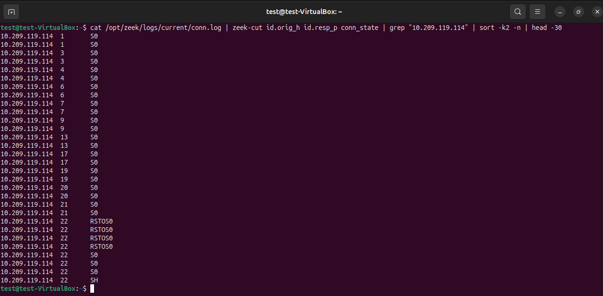
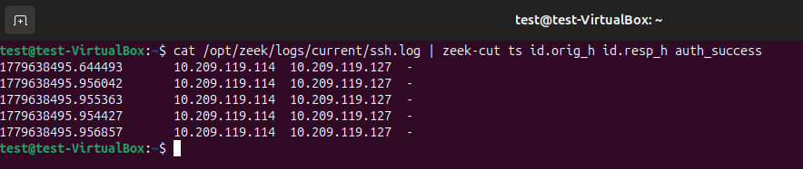
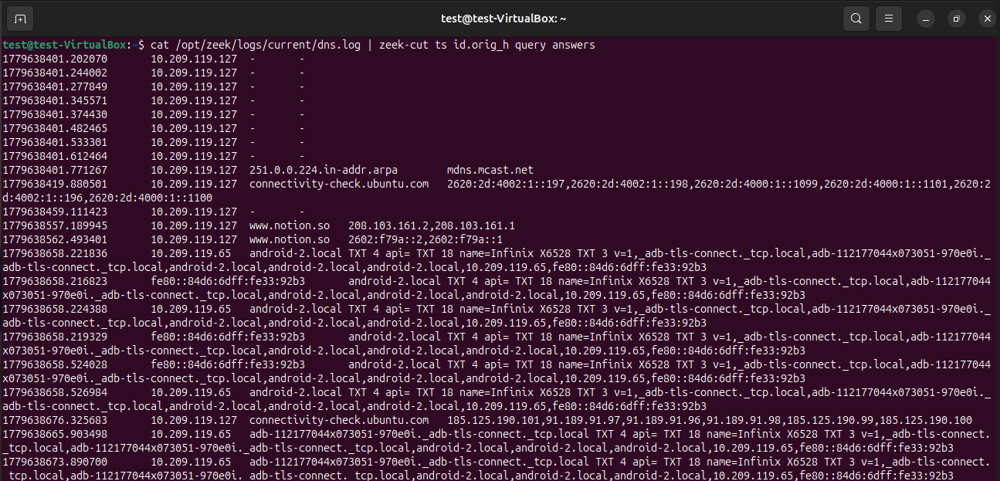
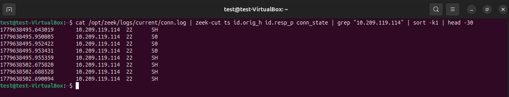

# Month 3 — Project 3.1 : Zeek + Network Analysis + MITRE ATT&CK

**Analyst:** Jean-Mik C. TINIGO
**Date:** May 2026
**Difficulty:** Intermediate
**Tools:** Zeek 8.2.0, Ubuntu Desktop 24.04, Ubuntu server 22.04

---

## Objective

Wazuh raises a level 12 alert — scan correlation + brute-force attack confirmed. As an analyst, i now need to investigate: what exactly happened on the network? Which ports were scanned? Were any connections established? Was any data transferred? Then i open Zeek.


---

## Lab Architecture

| Component        | Role                       | OS                      | IP             |
|------------------|----------------------------|-------------------------|----------------|
| Ubuntu Desktop VM| Target + IDS + Wazuh agent | Ubuntu 24.04 Desktop    | 10.209.119.127 |
| Ubuntu server VM | Attacker + Wazuh server    | Ubuntu 22.04 Server     | 10.209.119.114 |
| Hypervisor       | Host                       | Oracle VirtualBox 7.2.4 | —              |

Both machines communicate over a VirtualBox **Bridged** internal network.
Ubuntu desktop hosts Suricata (IDS) and wazuh-agent
Ubuntu server hosts Wazuh (SIEM) for alerts managements.

---

## Project Architecture 
```bash
Ubuntu Server (Attacker)
        │
        ▼ Network traffic
Ubuntu Desktop (Target)
        │
        ├── Suricata → eve.json → Wazuh (ALERTS)
        └── Zeek     → logs/    → manual analysis (CONTEXT)
                          │
                    conn.log    ← all connections
                    dns.log     ← all DNS queries
                    http.log    ← all HTTP traffic
                    ssh.log     ← all SSH sessions
                    notice.log  ← notable events
```

---

## Installation
For this lab, we will use Zeek. It's a (formerly "Bro") is a network analysis framework that stands out from traditional tools like Snort or Suricata. For an aspiring SOC Analyst, it's a fundamental tool to master because it transforms raw network traffic into structured and actionable data.
It allows us to stop "drowning in packets" and start "chasing threats" with clear, structured, and actionable data.

`WARNING : DO THIS STEP ON UBUNTU DESKTOP MACHINE`

```bash
# For update the system packets and upgrade them
sudo apt update && sudo apt upgrade -y 
# Add the Zeek repository 
echo 'deb http://download.opensuse.org/repositories/security:/zeek/xUbuntu_24.04/ /' \
  | sudo tee /etc/apt/sources.list.d/security:zeek.list
curl -fsSL https://download.opensuse.org/repositories/security:/zeek/xUbuntu_24.04/Release.key \
  | gpg --dearmor | sudo tee /etc/apt/trusted.gpg.d/security_zeek.gpg > /dev/null
sudo apt update
# Shows the available versions
sudo apt-cache policy zeek
# Install Zeek
sudo apt install zeek
# Add the directory to the PATH environment variable
echo "export PATH=$PATH:/opt/zeek/bin" >> ~/.bashrc
# Reload the .bashrc file immediately
source ~/.bashrc
# Show Zeek version
zeek --version
# Open the config file to add the network to survey
sudo nano /opt/zeek/etc/networks.cfg
# Then a the end of file add the network to survey, in the case of this lab, it's (10.209.119.127/24   Local network). Yes add this on the same line, the network and the description (Local Network)
# Open the config file to add Zeek configuration
# In this lab we will use Zeek on Cluster mode like on production environment
sudo nano /opt/zeek/etc/node.cfg
# Then you will comment these line because it's the standalone mode for Zeek 
```
```xml
#[zeek]
#type=standalone
#host=localhost
#interface=enp0s3
```
Next we will add cluster mode configuration. Worker, Logger, Manager and Proxy are the different roles found in a cluster. We have the host variable to define the ip adress of the machine (Ubuntu Desktop)
```xml
# logger
[zeek-logger]
type=logger
host=10.209.119.127

# manager
[zeek-manager]
type=manager
host=10.209.119.127

# proxy
[zeek-proxy]
type=proxy
host=10.209.119.127

# worker
[zeek-worker]
type=worker
host=10.209.119.127
interface=enp0s3

# worker localhost
[zeek-worker-lo]
type=worker
host=localhost
interface=lo
```

```bash
# Allows the current user to be the ownwer of Zeek directory and set his permissions
sudo chown -R $USER:$USER /opt/zeek/
chmod 755 /opt/zeek/
# Check if the config file are well configured 
zeekctl check
# Start Zeek in live mode
sudo /opt/zeek/bin/zeekctl deploy
# Check the status
zeekctl status

```

## Investigation with Zeek 

To understand what happened on the network, we will investigates using Zeek logs sources 

**1. Identifying the most active sources**
First step in any network investigation: who is talking the most?
An attacker generating a scan or brute-force will appear as an outlier in connection volume.
We will open the connexion log file and display the ip source field ($3), sort it by number of occurrences in descending order with connexion log file as a log source (conn.log).
```bash
test@test-VirtualBox:~$ cat /opt/zeek/logs/current/conn.log | zeek-cut id.orig_h | sort | uniq -c | sort -nr
   2009 10.209.119.114
    267 10.209.119.127
     32 127.0.0.1
     32 10.209.119.249
     26 fe80::84fa:a7ff:fea6:31fb
      4 fe80::84d6:6dff:fe33:92b3
      4 10.209.119.65
      2 fe80::8f66:a3f:8753:eb64
      2 10.209.119.183
      1 149.6.145.153
```
**Finding:** 10.209.119.114 with 2009 connections is extremely high, suggesting the attacker was very active. The victim machine (10.209.119.127) at 267 connections at second place is normal for a host receiving traffic.

**2. Determine the ports targeted by the attacker**
Which ports were contacted? An attacker this active certainly tries to connect with running ports.
That command list the contacted ports with the source ip ($3), the destination port ($6) and connection state ($16). In SOC, this display the list of target ports and who tried to contact them.
```bash
cat /opt/zeek/logs/current/conn.log | zeek-cut id.orig_h id.resp_p conn_state | grep "10.209.119.114" | sort -k2 -n | head -30
```
**Screenshot - Scan mapping**


**Finding:** 10.209.119.114 try multiple connections with differents ports. Mainly with ports `1,3` related to ICMP protocol. The presence of the `conn_state` with value `S0` indicates multiples scan on know TCP and UDP ports like `22` for SSH.

**3. Did attacker succeed to connect with SSH?**
Were there any successful SSH connections?
In the previous output, we notices that the principal target port is 22 (ssh). So we will investigates above and search for the successful ones. We display with timestamps ($1), source ip ($3), destination ip ($5) and authentication success ($7) based on Zeek ssh log file (ssh.log).
```bash
cat /opt/zeek/logs/current/ssh.log | zeek-cut ts id.orig_h id.resp_h auth_success
```
**Screenshot - Successful SSH Connections**


**Finding:** 10.209.119.114 try multiple SSH connections but the auth_success don't show up so he not succeed.

**4. How long connections sessions take ?**
What is the duration of the suspicious sessions? A very long duration time can give us an estimate of the activities that the attacker may have carried out.
We filter by connections that lasted more than a second ($9 > 1) and then display these fields : timestamps ($1), source ip ($3), destination port ($6) and duration ($9)
```bash
test@test-VirtualBox:~$ cat /opt/zeek/logs/current/conn.log | zeek-cut ts id.orig_h id.resp_p duration | awk '$4 > 1' | sort -k4 -rn | head -10
1779616847.153344       10.209.119.127  443     299.274429
1779616605.191702       10.209.119.127  443     290.790764
1779618476.385451       10.209.119.127  443     183.104257
1779618362.657560       10.209.119.127  443     177.318996
1779618361.149832       10.209.119.127  443     177.654128
1779617153.204908       10.209.119.127  443     171.260666
1779617095.290592       10.209.119.127  443     171.155931
1779616730.694330       10.209.119.127  443     171.750381
1779618259.040947       10.209.119.127  443     170.843937
1779618075.511854       10.209.119.127  443     170.333597
```
**Finding:** 10.209.119.127, the host machine have multiple connections specially with https `443` port ranging from 2 to 5 minutes. We need to figured out if it's legitimate traffic . 

**5. Is any suspect DNS Domain contacted ?**
Let's verify if the DNS (Domain Name System) log file (dns.log) catch non-legitimate traffic. Any DNS  traffic with suspicious `TLD` like `.xyz, .cc, .me` will be investigate. The command line below display the timestamp ($1), the source ip ($3), the duration ($9) and dns answers ($10) fields for each log line. 
```bash
cat /opt/zeek/logs/current/dns.log | zeek-cut ts id.orig_h query answers
```
**Screenshot - Suspicious DNS**


**Finding:** None suspicious DNS traffic detected. Maybe the attacker don't target the DNS.

**6. What connections states dominates?**
How many connections failed versus succeeded? 
With connexion log (conn.log) file we'll see the success and failure rates. This command line filter the connexion log file by connexion state field ($16) and the classes from most frequent to least frequent state.
```bash
test@test-VirtualBox:~$ cat /opt/zeek/logs/current/conn.log | zeek-cut conn_state | sort | uniq -c | sort -nr
   2028 S0
    729 OTH
     57 SHR
      7 RSTRH
      5 SH
      5 RSTOS0
      3 RSTO
```

**Finding:** Successfull connections state `SR + SHR = 62` are incredibily low compared to failed state `S0 + RSTRH + RSTOS0 + RSTO = 2043`. That means there's a active network scan, the majority of connections are attempting to reach closed or filtered ports.
This connection state `OTH` is for anormal traffic: connections that were not properly terminated (may indicate a deep network analysis or traffic shaping).

**7. Let's reconstruct the complete attack timeline**
Last step of any network investigation: Assemble the complete timeline of the attack in chronological order.
Here we'll reconstitute the complete timeline attack based on attacker ip address `10.209.119.114`. We obtain the first 30 connections issued by the machine 10.209.119.114, with the time ($1), destination port ($6), and status ($16) of each connection, in chronological order.
```bash
cat /opt/zeek/logs/current/conn.log | zeek-cut ts id.orig_h id.resp_p conn_state | grep "10.209.119.114" | sort -k1 | head -30
```
**Screenshot - Complete attack timeline**


**Finding:** 10.209.119.114 operates five (5) SSH semi-open connection `SH` against three (3) SYN sent that get no return `S0`. Here the successfull rate even if it's not complete is more high than the failed one. 

---

## Zeek conn_state ($16) values meaning

| Value | Description |
|---|---|
| S0 | SYN sent, no response → port closed or filtered = signature of a scan|
| S1 | Connection established, not yet closed|
| SF | Connection established AND properly closed → legitimate connection complete|
| SH | SSH connection established (TCP handshake successful)|
| REJ| Connection rejected (RST received) |
| RSTO | Connection reset from origin|

---

## Zeek logs field Name
```xml
# conn.log
$1 = ts            # Connection timestamp
$3 = id.orig_h     # Source IP (initiator)
$6 = id.resp_p     # Destination IP
$9 = duration      # Connection duration
$16 = conn_state   # Connection state

# ssh.log
$1 = ts            # Connection timestamp
$3 = id.orig_h     # Source IP (SSH client)
$5 = id.resp_h     # Destination IP (SSH server)
$7 = auth_success  # Authentication successful

# dns.log
$1 = ts            # Query timestamp
$3 = id.orig_h     # Source IP (of the query)
$9 = query         # Domain name queried
$10 = answers      # DNS responses
```

---

## Suricata vs Zeek — Same Event, Two Perspectives

- **Event Tested: Nmap SYN scan from 10.209.119.114**

### What Suricata saw (alert)
Rule triggered: "SCAN Nmap TCP SYN packet detected" (SID 1000002)
→ Suricata says: ALERT, someone is scanning
→ Information: who is attacking, which rule, which level

### What Zeek saw (context)
conn.log: 950 S0 connections from 10.209.119.114 in 6 seconds
→ Zeek says: here are EXACTLY the 950 ports contacted, with precise timestamp, duration, and status of each attempt

**Conclusion:**
Suricata confirms that this is a known attack.
Zeek reveals the exact scope — which ports, for how long,in what order. Without Zeek, we know there was a scan.
With Zeek, we know what the attacker was looking for.

- **Event Tested: Hydra Brute-force SSH from 10.209.119.114**

### What Suricata saw (alert)
Rule triggered: "Suricata: Alert - SSH Brute Force Attempt Detected" (SID 86601)
→ Suricata says: ALERT, someone is trying multiple SSH connections
→ Information: who is attacking, which rule, which level

### What Zeek saw (context)
ssh.log: 5 SSH connections detected from 10.209.119.114
-> Zeek says: here are exactly 5 SSH connections attemps, with precise timestamp, source ip, destination ip and if the authentication succeed or not of each attempt

**Conclusion**
Suricata confirms that this is a known attack.
Zeek reveals the tries number — which one succeed, for how long,in what order. Without Zeek, we know there was a SSH brute-force attempt.
With Zeek, we know if the attacker succeed to connect or not.

- **Event Tested: ICMP Ping from 10.209.119.114**

### What Suricata saw (alert)
Rule triggered: "ICMP Ping" (SID 100001)
→ Suricata says: ALERT, someone is trying to communicate 
-> Information: who is attacking, which rule, which level

### What Zeek saw (context)
conn.log : Ping attempts (ICMP Echo Request) from 10.209.119.114
-> Zeek says : here are Unanswered ping attempts (ICMP Echo Request) or ICMP blocked, with precise timestamp, source ip, destination ip and the connexion state of each attempt

**Conclusion**
Suricata flags this as suspicious activity.
Zeek reveals the exact amonth of connexions — the exact connexion state, for how long,in what order. Without Zeek, we know there was a ICMP Ping attempt.
With Zeek, we know how many attemps the attacker tried and each attempt result.

---

## MITRE ATT&CK Coverage

| Technique ID | Name | Detection |
|---|---|---|
| T1595.002 | Active Scanning: Port Scanning | Multiple SYN connections to various ports (conn_state: S0) |
| T1110.001 | Brute Force: Password Guessing | Multiple SSH attempts auth_success: false |
| T1078 | Valid Accounts | SSH session auth_success: true |
| T1571 | Non-Standard Port | Connections to non-standard ports |

---

## Challenges and Lessons learned
- Log directory `/var/log/zeek/current/conn.log` and `/opt/zeek/logs/current/conn.log`
When i tried first to investigate on zeek logs, i don't find them using this directory `/var/log/zeek/current/conn.log`. At first i think it's due to my Zeek cluster mode but the truth is Zeek is not installed from the classic system packages (apt), but in /opt/zeek.
Indeed I chose the official binary installation, which is more up-to-date, but with dedicated paths. So with this installation, my log directory is `/opt/zeek/logs/current/conn.log`.

- Command `sudo /opt/zeek/bin/zeekctl deploy` instead of `zeekctl deploy`
During installation, launch the classic command `zeekctl deploy` work but the Zeek roles (worker and worker localhost) would not start due to a lack of permission by using the system interfaces (enp0s3 and lo). So i use this commande with `sudo` at the beginning but that did not work because the PATH I defined in ~/.bashrc is not used by the sudo session. 
To correct that i just specified the absolute path of the command like this `sudo /opt/zeek/bin/zeekctl deploy`.
---

## Resources used

- [Zeek Documentation](https://docs.zeek.org/en/master/)


