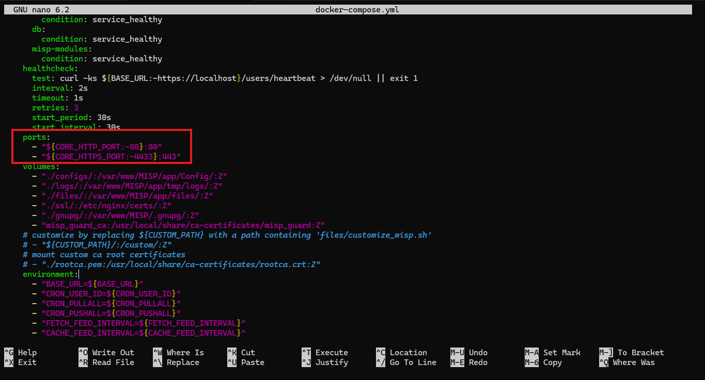
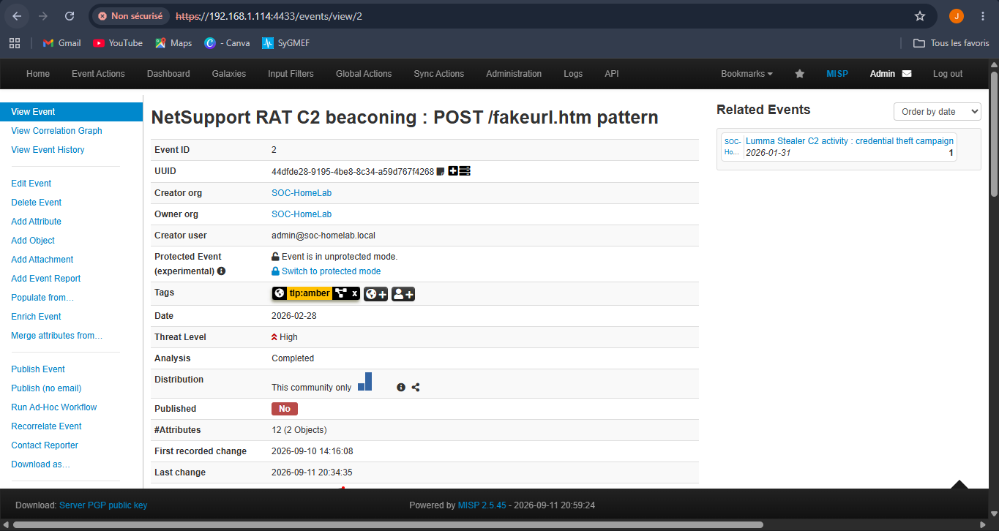
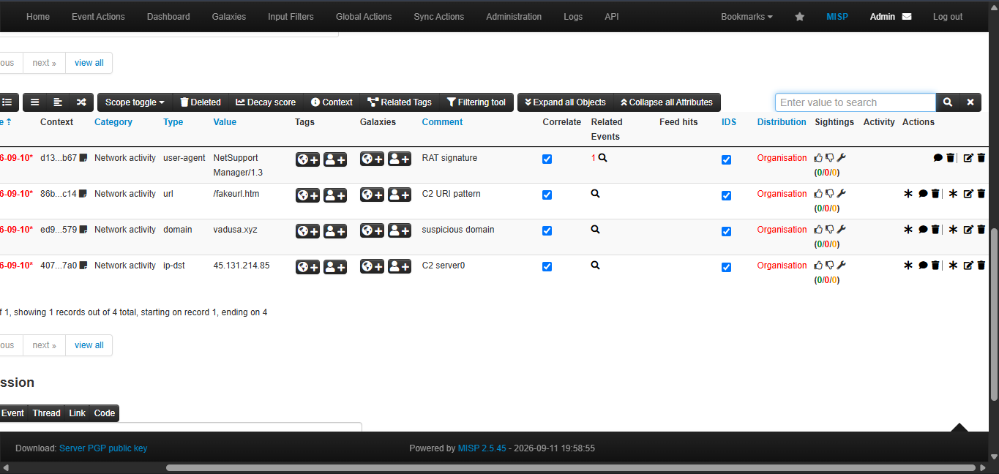
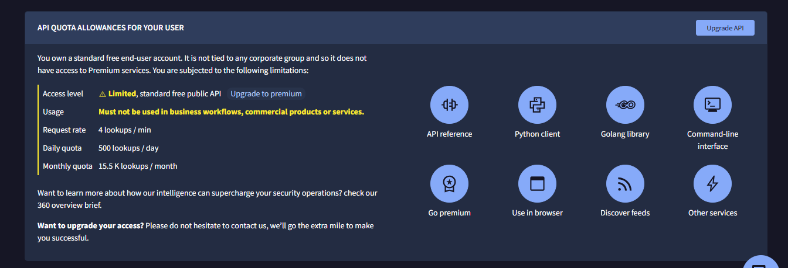
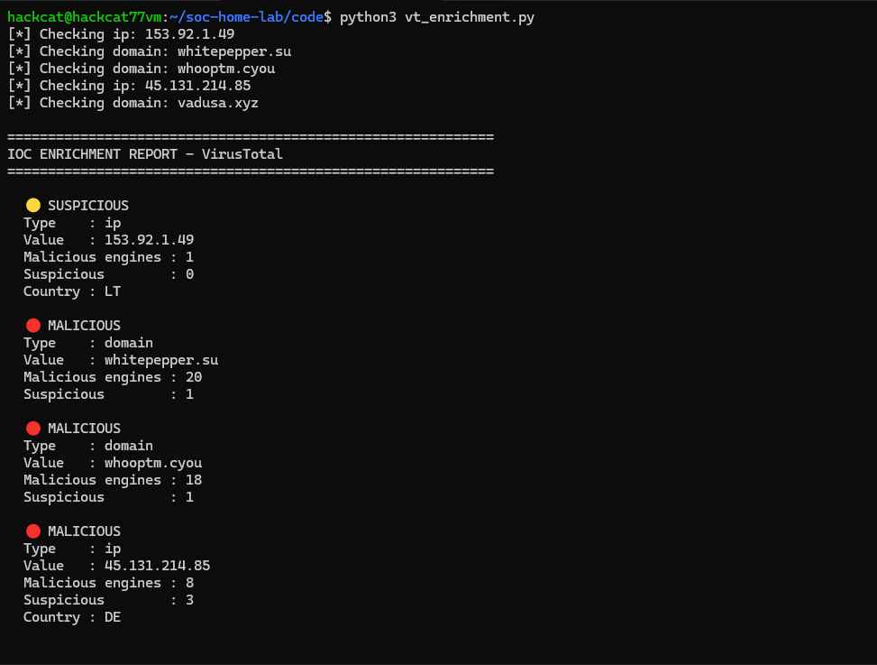
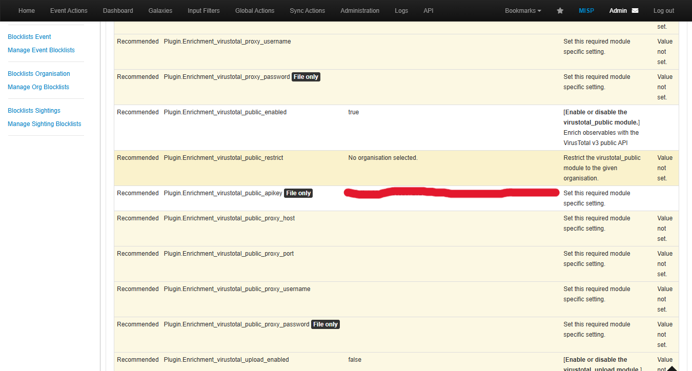
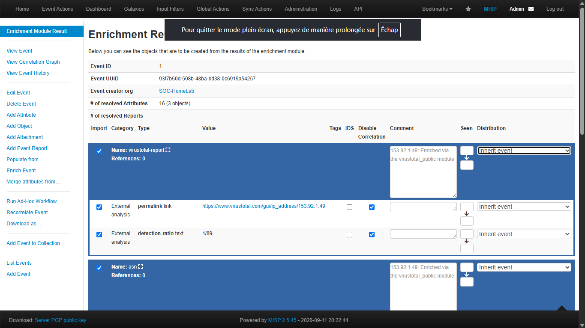
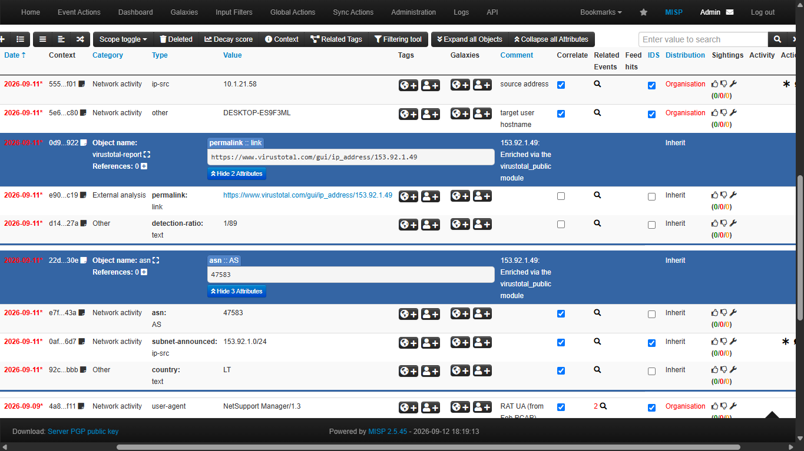
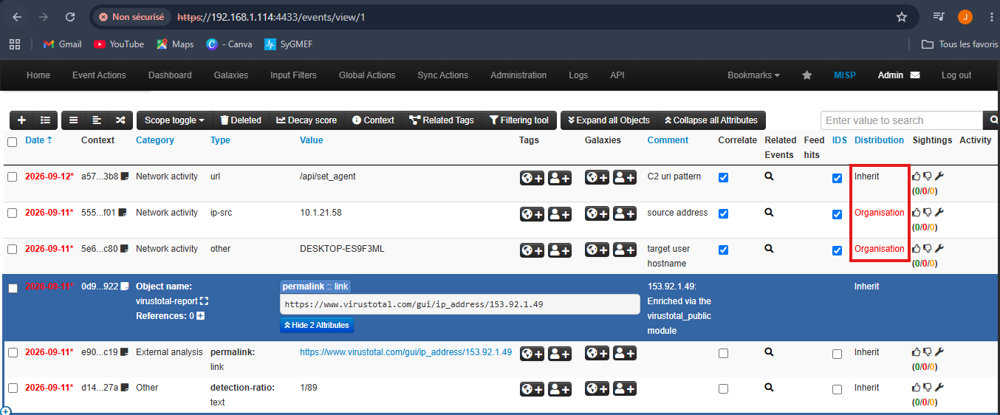
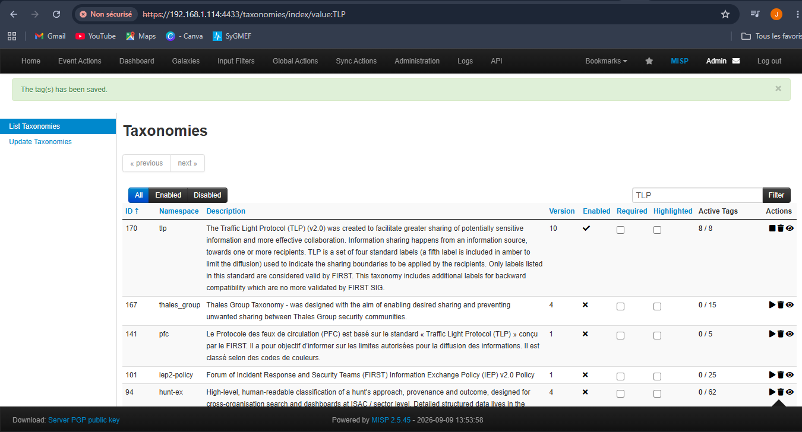

# Month 4 - Project 4.1 : MISP - Plateforme CTI + Enrichissement IOCs

**Analyst:** Jean Mik C. TINIGO
**Date:** September 2026
**Difficulty:** Intermediate
**Tools:** Ubuntu Desktop 22.04, MISP 2.5.45, Docker 29.8.0 

---

## Context & Objective
A SOC Analyst can receive a hundred of alerts everyday. For each alert who isn't a false positive, he collect the IOCs and verify them. 
This large amount of trafic can  become boring to threat manually. That's one part of the problem that `MISP` can solve.
MISP is a proactive sharing platform where many connected organisations can publish IOCs to each other. It allow automatic correlation of IOCs with existing event in the database. MISP provides a structural context of an IOC, not only telling you if he's malicious or not. 
In this lab we are a Threat Intelligence analyst. Two incidents have been documented: Lumma Stealer and NetSupport RAT (Month 1 malware). We will create the corresponding MISP events, structure the IOCs, and build an automated enrichment pipeline using the VirusTotal API.

---

## Lab Architecture

| Component        | Role                        | OS                      | IP             |Resources|
|------------------|-----------------------------|-------------------------|----------------|---------|
| Ubuntu Server VM | MISP server   | Ubuntu 22.04 Server   | 192.168.1.114  |5GB of RAM; 3 cores|
| Hypervisor       | Host                        | Oracle VirtualBox 7.2.4 | -              |-|


---

## MISP installation

- We will install MISP from docker and start the container 
```bash
# Prerequisites
sudo apt install docker.io docker-compose git -y

# Clone the github MISP docker repository
git clone https://github.com/MISP/misp-docker.git
cd misp-docker

# Copy and configure the environment
cp template.env .env
nano .env
```

- In the `.env` file, edit these variables
```xml
MISP_BASEURL=https://192.168.1.114:4433 (add ":4433" is optional if you don't wanna specify a port)
MISP_ADMIN_EMAIL=<your_admin_email>
MISP_ADMIN_PASSWORD=<your_admin_password>
MISP_ORG=SOC-HomeLab
CORE_HTTPS_PORT=4433 (optional)
```
For my MISP server, i want to start of the port `4433` (it's optional you can make it without specify a port) so, we will edit the `docker-compose.yml` file too. Search `CORE_HTTPS_PORT` and edit the port value to the one you want to use `4433` for me.

**Screenshot — Port change in docker compose :**


- Start the MISP docker container
```bash
# start the misp containers
docker compose up -d

# verify the active containers
docker compose ps
```

- Then connect to misp dashboard with your url 
---

## Create MISP events

Go to MISP -> Add Event

- Event 1 - Lumma Stealer (2026-01-31)
```text
Date          : 2026-01-31
Distribution  : This Community Only
Threat Level  : High
Analysis      : Complete
Info          : Lumma Stealer C2 activity - credential theft campaign
Tags          : tlp:amber 

# Attributs (IOCs)
Type: ip-dst        Value: 153.92.1.49          Comment: C2 server
Type: domain        Value: whitepepper.su        Comment: C2 domain
Type: domain        Value: whooptm.cyou          Comment: secondary domain
Type: url           Value: /api/set_agent         Comment: C2 URI pattern
Type: user-agent    Value: NetSupport Manager/1.3 Comment: RAT UA (from Feb PCAP)
Type: hostname      Value: DESKTOP-ES9F3ML       Distribution: Your Org Only (important)
Type: ip-src        Value: 10.1.21.58            Distribution: Your Org Only (important)
```

**Screenshot — Event 1 on MISP :**


- Event 2 - NetSupport RAT (2026-02-28)
```text
Date          : 2026-02-28
Distribution  : This Community Only
Threat Level  : High
Analysis      : Complete
Info          : NetSupport RAT C2 beaconing - POST /fakeurl.htm pattern
Tags          : tlp:amber 

# Attributs (IOCs)
Type: ip-dst     Value: 45.131.214.85         Comment: C2 server
Type: domain     Value: vadusa.xyz            Comment: suspicious domain
Type: url        Value: /fakeurl.htm          Comment: C2 URI pattern
Type: user-agent Value: NetSupport Manager/1.3 Comment: RAT signature

```

**Screenshot — Event 2 on MISP :**


**Screenshot — IOCs examples on MISP :**


---

## Enrichment via VirusTotal API

- First we need to go on `https://www.virustotal.com`, create an account and get a free api key. This free account give us a limited range of lookups `4 lookup/min, 500 lookups/day`

**Screenshot — Virustotal free account API options :**


- Test the fonctionnality of the api key with this python code,
[Virustotal enrichment python code](./vt_enrichment.py)

- Execute the code with this command `python3 vt_enrichment.py` and you will see something like this : 

**Screenshot — IOCs enrichment python script result:**


---

## Connect MISP to Virustotal

MISP can automatically enrich attributes via its modules.

- Go to MISP -> Administration -> Server Settings & Maintenance -> Plugin. 
In the search bar, write `virustotal` and go to the `Enrichment` section. 
    - Put this plugin `Plugin.Enrichment_virustotal_public_enabled` value to `true`
    - Paste your public api key from virustotal as a value for this plugin `Plugin.Enrichment_virustotal_public_apikey`  

**Screenshot — Enable Virustotal public and Paste your api key**


- Then we will try the enrichment on the IOC we create in our event. Go to event 1, select the `ip_dst` attribute (IOC) and click on the icon that look like an asterisk (*) then select the `Virustotal public api option` and wait for the result.


**Screenshot — IOC enrichment result on MISP**


After that you select what attribute you want to keep and click `Submit`, it will be added to your event IOCs

**Screenshot — Event 1 iocs after enrichment**


---

## Shared IOCs (TLP:AMBER) vs private IOCs (org only)

We should be careful regarding which IOC we share. 
The rule in CTI is: share what helps others defend themselves, keep what exposes us.
- IOCs that could reveal information about the company's structure or operations must not be shared. Like `Victim internal IPs, hostnames, compromised usernames, precise incident timestamps (which reveal your monitoring schedule), and any information that allows for mapping your network or vulnerabilities`.

- Only those whose disclosure poses no threat whatsoever to the company may be shared such as `C2 IPs, malicious domains, URLs, malware hashes, suspicious User-Agents, and Suricata/YARA rule patterns `. These elements enable other organizations to detect the same threat without revealing anything about you. 

To illustrate, for our event 1 on MISP 

| Shared IOCs      | Private IOCs                | 
|------------------|-----------------------------|
| 153.92.1.49      | 10.1.21.58                  | 
| whitepepper.su   | DESKTOP-ES9F3ML             | 
| /api/set_agent   | -                           | 

**Screenshot — shared vs private IOCs**


---

## What does enrichment offer compared to manual verification?

Enrichment offer much more information than manual verification. Enrichment provides information based not only on virustotal api but also all the references present in the database. It returns all occurences he finds about an IOC shared by the connected community. 
For example, a hash on VirusTotal tells you "malicious: yes/no." MISP tells you: who used it, in which campaign, what other IOCs are associated with it, which MITRE technique is involved, and the period of activity. That is the difference between an alert and intelligence.
MISP contextualizes, correlates, and shares. It is threat intelligence, not just verification.

---

## MITRE ATT&CK Coverage

| Technique ID | Name | Evidence in lab |
|---|---|---|
| T1583.001 | Acquire Infrastructure: Domains | C2 domains whitepepper.su, vadusa.xyz identified and documented in MISP |
| T1588.001 | Obtain Capabilities: Malware | Lumma Stealer and NetSupport RAT capabilities structured as MISP events |
| T1071.001 | Application Layer Protocol: HTTP | C2 over HTTP POST documented in MISP URL attributes |
| T1219 | Remote Access Software | NetSupport RAT documented as MISP event with C2 IOCs |
| T1555.003 | Credentials from Web Browsers | Lumma Stealer credential theft documented — agent=Chrome/Edge in URL |

---

## Challenges and Lessons Learned

- **Update my docker engine :**
Some variables needed such as `start_period` aren't recognize by my actual docker version. So i read the documentation and install the latest version.

- **TLP options don't show up on the tags section. :**
It's normal , this option is disable by default so we need to manually enable it. 
This option is essential to choose who can actually see or consult my event.
So after some research, i go to MISP -> Event Actions -> List Taxonomies. 
Put `tlp` is the searchbar and enable it 

**Screenshot — Enable TLP**


- **Change the time sleep from 15 to 20  :**
When i try first to execute my python code to test my virustotal public api key, it's stop checking after the third ioc. After try many times, i understand that the first three iocs are verify perfectly. My interface on virustotal website also show the types and amount of lookups he receive and process.
So i add five seconds to the waiting time to see what happen because i made a hypothesis that the sleep time are too short for an api that can only process four lookups per minute and it work. 
 
- **The `ForbiddenError` from enrichment :**
While enabled the plugin enrichment api for virustotal, i enabled this one called `Plugin.Enrichment_virustotal_enabled` with this one `Plugin.Enrichment_virustotal_apikey` because i seems obvious to me. 
After that every attempt i made for enrichment was failing and say "ForbiddenError". First i know isn't my api key because i already tried it with my python code. 
I search online what this error means but don't really find how to fix it but i find something interesting about misp enrichment issues on github.
I decide to look on the docker logs to see what i can find, i use this command `docker logs misp-docker-misp-core-1` and find this 
```json
{"name":"virustotal","type":"expansion", ... "requirements":["An access to the VirusTotal API (apikey), with a high request rate limit."], ... "config":["apikey",...]}
{"name":"virustotal_public","type":"expansion", ... "requirements":["An access to the VirusTotal API (apikey)"], ... "config":["apikey",...]}
```
From there i make a hypothesis that i use the wrong module (plugin). I go back to the section where i enabled the plugin and start looking for anything i can find. There i got it, there are another modules specifically designed for public api, this one `Plugin.Enrichment_virustotal_public_enabled` with this one `Plugin.Enrichment_virustotal_public_apikey`. I enable them and i disable this one `Plugin.Enrichment_virustotal_enabled`
Then it works.
Conclusion : The first plugin i enabled use a request rate limit higher than mine with only 4 lookup/min, 500 lookups/day.

---

## Resources Used

- [Docker Engine](https://docs.docker.com/engine/install/ubuntu/)
- [MISP virustotal public api module](https://misp.github.io/misp-modules/expansion/#virustotal-public-api-lookup)
- [MITRE ATT&CK](https://attack.mitre.org)
- [Github MISP enrichment issue](https://github.com/MISP/MISP/issues/2029)

