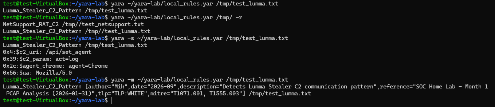
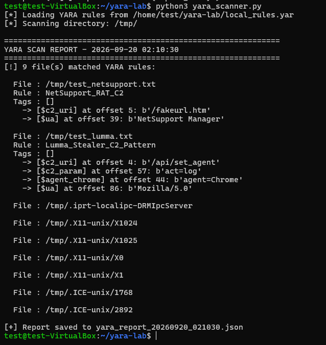

# Month 4 - Project 4.2 : YARA Rules + Static malware analysis

**Analyst:** Jean Mik C. TINIGO
**Date:** September 2026
**Difficulty:** Intermediate
**Tools:** Ubuntu Desktop 22.04, Yara 4.5.0

---

## Context & Objective
An IOC is good to refer an attack but it's really trustable ?
Not really, most IOC are short-lived like IP and domain. That represents boundaries, an attacker changes their IP address within 24 hours and registers a new domain in 5 minutes.
So how can you ensure an effective detection system ?

This is where YARA rules comes up.

We are a Threat Intelligence analyst. Following the documentation of the Lumma Stealer and NetSupport RAT campaigns in MISP, our manager asks us to write YARA rules to detect this malware on endpoint, even if the C2 infrastructure changes.

---

## Lab Architecture

| Component        | Role                        | OS                      | IP             |Resources|
|------------------|-----------------------------|-------------------------|----------------|---------|
| Ubuntu Desktop VM | MISP server   | Ubuntu 22.04 Desktop   | 192.168.1.127  |5GB of RAM; 3 cores|
| Hypervisor       | Host                        | Oracle VirtualBox 7.2.4 | -              |-|

---

## YARA installation

On Ubuntu Desktop
```bash
# Install YARA
sudo apt install yara -y
yara --version

# Install Python-YARA for scripts
pip3 install yara-python --break-system-packages

# Use this one if the one above don't work
sudo apt install python3-yara
```

---

## YARA Rules structure 

Before write yara rules, let understand how they work. Here is the syntax

```text
rule RuleName {
    meta:
        author      = "Maik"
        date        = "2026-09"
        description = "what the rule trigger"
        reference   = "rule source"
        tlp         = "TLP:WHITE"

    strings:
        $string1 = "exact text to search for"
        $string2 = "other text"
        $hex1    = { 4D 5A 90 00 }   // séquence d'octets en hexa
        $regex1  = /api\/set_agent\?id=[A-F0-9]{32}/ // regular expression

    condition:
        // Detection logic
        uint16(0) == 0x5A4D       // Verify that it is a PE file (MZ header)
        and ($string1 or $string2)
        and $hex1
}
```

YARA rules are three mandatory section : `meta`, `strings` and `condition`

| Section | Role |
|---|---|
| meta | Metadata : author, date, description, TLP | 
| strings | Patterns to search for (text, hex, regex) | 
| condition | The Boolean logic that triggers the rule | 

That it, we will understand more about with the following examples.

---

## YARA rules (3 rules examples)

Let's write three YARA rules to detect malware on system.

First, create the rules file to store our rules : 
```bash
nano ~/yara-lab/local_rules.yar
```

Rule 1 : Lumma Stealer C2 Pattern
**NB: These rules are based on what we found on PCAP files analysis during month 1**
```text
rule Lumma_Stealer_C2_Pattern {
    meta:
        author      = "Mik"
        date        = "2026-09"
        description = "Detects Lumma Stealer C2 communication pattern"
        reference   = "SOC Home Lab - Month 1 PCAP Analysis (2026-01-31)"
        tlp         = "TLP:WHITE"
        mitre       = "T1071.001, T1555.003"

    strings:
        // C2 URI pattern from PCAP analysis
        $c2_uri     = "/api/set_agent" ascii nocase
        // Token parameter structure
        $c2_param   = "act=log" ascii nocase
        // Agent parameter for browser credential theft
        $agent_chrome = "agent=Chrome" ascii nocase
        $agent_edge   = "agent=Edge" ascii nocase
        // Lumma Stealer User-Agent pattern
        $ua = "Mozilla/5.0" ascii

    condition:
        $c2_uri and
        ($c2_param or $agent_chrome or $agent_edge) and
        $ua
}
```

**Explanation :**
- **Meta :**
Here we write basics information about the rules like who write it `author`, when the rule is written `date`, a description to explain the purpose of that rule `description`, a referense or a source `reference`, choose a tlp `tlp` and then specify some mitre attack technique that corresponding `mitre`.

**NB: For the meta section it's basically the same principe for all rules. No need to repeat this section in the other explanation.**

- **strings :**
For this we store into a variable every pattern or features that refer to the malware, these pattern was identify during the analysis of the PCAP file in month 1. So, for this rule we have an uri `$c2_uri`, a token parameter `$c2_param`, an the agent parameter that indicates the browser `$agent_chrome`, `$agent_edge` and the user-agent `$ua`. All this five variables will be use as a references to detect the malware.

**NB: Observe that all the variable use this format $variable_name = "value"**

- **condition :**
Now that we have all the variables we need, let's make the logic that will trigger the rule.
We use these parameters `and`, `or` to establish the condition. This tule will trigger when the uri `$c2_uri`, one of these (`$c2_param` or `$agent_chrome` or `$agent_edge`) and the user-agent `$ua` will be detected. 

The uri and the user-agent are mandatory for the detection. In addiction of these, one value between the browser agents and the token parameter need to complete. 

In conclusion, we need three patterns to trigger the rule.


Rule 2 : NetSupport RAT Detection
```text
rule NetSupport_RAT_C2 {
    meta:
        author      = "Mik"
        date        = "2026-09"
        description = "Detects NetSupport RAT C2 communication pattern"
        reference   = "SOC Home Lab - Month 1 PCAP Analysis (2026-02-28)"
        tlp         = "TLP:WHITE"
        mitre       = "T1219, T1071.001"

    strings:
        // Known C2 URI from NetSupport RAT
        $c2_uri     = "/fakeurl.htm" ascii nocase
        // NetSupport Manager User-Agent signature
        $ua         = "NetSupport Manager" ascii
        // Server response banner
        $server     = "NetSupport Gateway" ascii

    condition:
        $c2_uri and ($ua or $server)
}
```

**Explanation :**
- **strings :**
Define pattern of the malware, the URI `$c2_uri`, the user-agent `$ua` and the server response banner `$server`. All related to the PCAP file analysis.

- **condition :**
To trigger this rule, we need the uri `$c2_uri` add to one pattern between the user-agent `$ua` and the server banner `$server`.

For conclusion, we need two patterns to trigger the rule.

Rule 3 : Generic PE Suspicious Strings
**Generic rule for detecting suspicious behavior in Windows PE files**

```text
import "pe"

rule Suspicious_PE_Strings_v2
{
    meta:
        author      = "Mik"
        date        = "2026-09"
        description = "Detects suspicious PE behavior: credential theft, HTTP C2, obfuscated PowerShell, process injection"
        tlp         = "TLP:WHITE"
        reference   = "https://attack.mitre.org/techniques/T1055/"
        version     = "2.0"

    strings:
        // Credential theft (specific strings, not just "password" on its own)
        $cred_1 = "Login Data"                 ascii nocase   // Chrome/Edge credential DB
        $cred_2 = "CryptUnprotectData"         ascii nocase   // Decryption API DPAPI
        $cred_3 = "wallet.dat"                 ascii nocase   // wallets crypto
        $cred_4 = "Software\\Microsoft\\Windows\\CurrentVersion\\Credential" ascii nocase
        $cred_5 = "logins.json"                ascii nocase   // Firefox credentials

        // HTTP C2 (form-urlencoded POST = classic exfiltration)
        $http_1 = "Content-Type: application/x-www-form-urlencoded" ascii
        $http_2 = "Content-Type: multipart/form-data"               ascii
        $http_3 = "User-Agent: Mozilla/"                            ascii

        // Obfuscated PowerShell (EncodedCommand = base64)
        $ps_1 = "-EncodedCommand" ascii nocase
        $ps_2 = "-enc "           ascii nocase   // abbreviated form
        $ps_3 = "-nop"            ascii nocase   // -NoProfile
        $ps_4 = "FromBase64String" ascii nocase  // .NET decode

        // Other useful TTPs
        $misc_1 = "cmd.exe /c "    ascii nocase
        $misc_2 = "schtasks /create" ascii nocase  // persistence
        $misc_3 = "reg add"          ascii nocase  // persistence via registre

    condition:
        // Structural prerequisites: valid PE, reasonable size, unsigned
        uint16(0) == 0x5A4D                          // MZ header
        and filesize < 5MB
        and pe.number_of_sections > 0                // at least one PE section
        and pe.number_of_sections < 16               // not some weird packed binary

        and ((2 of ($cred_*)) // Branch 1: credential theft, at least 2 indicators

            or

            // Branch 2: HTTP C2 : form-urlencoded header + another signal
            (($http_1 or $http_2) and ($http_3 or 1 of ($cred_*)))

            or

            // Branch 3: Obfuscated PowerShell, at least 2 PS flags
            (2 of ($ps_*))

            or

            // Branch 4: injection, actual imports into the PE table (NOT strings!)
            (
                pe.imports("kernel32.dll", "VirtualAllocEx")
                and pe.imports("kernel32.dll", "WriteProcessMemory")
                and (
                    pe.imports("kernel32.dll", "CreateRemoteThread")
                    or pe.imports("kernel32.dll", "CreateRemoteThreadEx")
                    or pe.imports("ntdll.dll", "NtCreateThreadEx")
                )
            )

            or

            // Branche 5 : persistence (schtasks or reg add + cmd)
            ($misc_2 or $misc_3) and $misc_1
        )
}
```

**Explanation :**
- **strings :**
    - Credential theft : Each string targets a specific artifact of credential-stealing behavior. The `\\` in YARA is an escape sequence: `//` in the rule corresponds to a single `\` in the binary.
    - HTTP C2 : A legitimate HTTP client posting a form will generally not have more than one pattern here. A C2 exfiltrating credentials will have at least two.
    - Obfuscated PowerShell : Some frequents command line options included short forms (-enc instead of -EncodedCommand) that attackers use.
    - Other useful TTPs : `$misc_2` scheduled task creation, `$misc_3` registry modification (typically Run keys), `$misc_1` shell execution. 


- **condition :**
    - `uint16(0) == 0x5A4D`, it reads the first two bytes of the file (offset 0, 16 bits) and verifies that they are 0x5A4D. In little-endian, this corresponds to the bytes 4D 5A = MZ, the signature for all Windows executables (PE). Without this check, your rule would also match documents, scripts, etc.
    - `filesize < 5MB` limits the rule to files smaller than 5 MB. This avoids scanning large binaries (which is CPU-intensive) and prevents false positives on large files that happen to contain these strings.
    - `pe.number_of_sections` 
        > 0: A valid PE file has at least one section (typically .text). This filters out false positives (files that happen to start with "MZ").

        > 16: A standard PE file has 3–8 sections. Anything over 16 is very often a packed or encrypted binary (e.g., UPX, Themida) or a corrupted one. This prevents your rule from matching packers that contain arbitrary data.
    - Branch 1: `2 of ($cred_*)` requires at least 2 of these 5 indicators. A binary that interacts with `Login Data` and `CryptUnprotectData` is clearly engaging in credential theft. A binary that merely contains the word `password` somewhere no longer triggers a match (to understand why i say this, check the `Challenges ans Lessons Learned` section).
    **NB: This notation `$cred_*` refer to every variables that start with `$cred_`**
    - Branch 2: `$http_1 and ($http_3 or 1 of ($cred_*))` requires `$http_1` and either a browser User-Agent `$http_3` refer to an classic C2 mimicry. Or another credential indicator that refer to credential exfiltration via HTTP.
    - Branch 3: `2 of ($ps_*)` A binary containing `-EncodedCommand` and `FromBase64String` is clearly using obfuscated PowerShell.
    - Branch 4: Process injection - YARA parses the PE's actual import table (the .idata section) and verifies that the binary genuinely imports these functions from kernel32.dll. 
    This is incomparably more precise:
        - A binary that does not use VirtualAllocEx but contains the string in a debug comment is no longer matches
        - A binary that actually imports these three functions matches, even if the names are obfuscated or stripped as strings.
        This requires `VirtualAllocEx`, `WriteProcessMemory` and one of these three `CreateRemoteThread`,`CreateRemoteThreadEx`,`NtCreateThreadEx`.

        | Command | DLL source | Role |
        |---|---|---|
        | VirtualAllocEx | kernel32.dll | Allocates memory in another process (the target process for the injection) |
        | WriteProcessMemory | kernel32.dll | Writes data (shellcode, DLL path, etc.) into the allocated memory of the target process. |
        | CreateRemoteThread | kernel32.dll | Create a thread in the target process to execute the injected code (classic API) |
        | CreateRemoteThreadEx | kernel32.dll | Modern variant of CreateRemoteThread, with extended attributes (e.g., thread constraints) |
        | NtCreateThreadEx | ntdll.dll | Low-level (undocumented) thread creation version, often used to bypass EDR hooks. |   

        The first two are mandatory (memory and content are required). The third has three interchangeable variants, depending on the level of evasion the attacker seeks.
    
    - Branch 5 : `($misc_2 or $misc_3) and $misc_1` requires `$misc_1` (shell) AND one of the two persistence mechanisms. This is a strong indicator of malware establishing persistence via a shell. 
        

You can consult the local yara rules here : [YARA rules](./local_rules.yar)
 
---

## Attributes Roles
Define variables requires somes attributes, let's check their meaning:

| Attributes | Role |
|---|---|
| ascii | Look for the ASCII version of the string (1 byte per character) |
| nocase | Case-insensitive (ex : "password" matches password, Password, PASSWORD, PaSsWoRd) |
| wide | Also look for the UTF-16LE version (2 bytes per character, typical of Windows). "password" becomes p\x00a\x00s\x00s\x00... | 

---

## Test and automation script

- Use these commands to create a text file that contains the strings we want.
```bash
cat > /tmp/test_lumma.txt << 'EOF'
GET /api/set_agent?id=3BF67EC0&token=842e28&agent=Chrome&act=log HTTP/1.1
User-Agent: Mozilla/5.0 Chrome/144.0.0.0
Host: whitepepper.su
EOF

cat > /tmp/test_netsupport.txt << 'EOF'
POST /fakeurl.htm HTTP/1.1
User-Agent: NetSupport Manager/1.3
Host: 45.131.214.85
EOF
```

Then start the YARA scans
```bash
# Test the rule on a file 
yara ~/yara-lab/local_rules.yar /tmp/test_lumma.txt

# Test the rule on a directory
yara ~/yara-lab/local_rules.yar /tmp/ -r

# Verbose mode : view the strings that matched
yara -s ~/yara-lab/local_rules.yar /tmp/test_lumma.txt

# Scan with metadata
yara -m ~/yara-lab/local_rules.yar /tmp/test_lumma.txt
```

Results will look like this : 

**Screenshot — YARA rules tests result**


- Lets's automate the scan on a directory with python
Consult the automation code here :
[Python code for YARA scan automation](./yara_scanner.py)

The result look like this :

**Screenshot — YARA automation script result**


---

## IOC vs YARA : When to use which 

IOC defines a specific values that identify a malware, an attack or an attacker such as IP, domains, hash etc.. These values can be use to report on a MISP event, or an IPS rules to block them. 
Unfortunatly they are not permanent. The attacker can change his identifiers (IOCs) and use the same technique to get in and reach his goal. 

That's where YARA rules intervenes. They are based on the behavior so an attacker can use a lot of different values to get what he want but if they obey on the same process YARA rules will be triggered.
YARA rules is use to prevent an attacker or any threat to reach his goal using an known or observed pattern.

--- 
## MITRE ATT&CK Coverage

| Technique ID | Name | YARA Rule |
|---|---|---|
| T1071.001 | Application Layer Protocol: HTTP | Lumma_Stealer_C2_Pattern — /api/set_agent |
| T1555.003 | Credentials from Web Browsers | Lumma_Stealer_C2_Pattern — agent=Chrome/Edge |
| T1219 | Remote Access Software | NetSupport_RAT_C2 — /fakeurl.htm |
| T1059.001 | PowerShell | Suspicious_PE_Strings_v2 — -EncodedCommand |
| T1055.001 | Process Injection: DLL Injection | Suspicious_PE_Strings_v2 — VirtualAllocEx + WriteProcessMemory |
| T1547.001 | Registry Run Keys / Startup Folder | Suspicious_PE_Strings_v2 — reg add |
| T1053.005 | Scheduled Task | Suspicious_PE_Strings_v2 — schtasks /create |


---

## Challenges and Lessons Learned

- **Miss condition section variable error occured :**
During my first attempt, i forgot `$server` for the RAT rule in the condition section and got an error for that. In the condition section i only write this `$c2_uri and $ua`. Conclusion: Every variable create in the `strings` section needs to be involve in the `condition` section.

- **Increase rule 3 efficiently :**
Here is the first version,
```text
rule Suspicious_PE_Strings {
    meta:
        author      = "Mik"
        date        = "2026-09"
        description = "Detects suspicious strings commonly found in malware"
        tlp         = "TLP:WHITE"

    strings:
        // Common credential theft strings
        $cred1 = "password" ascii nocase wide
        $cred2 = "LoginPassword" ascii nocase
        // Common C2 communication strings
        $http1 = "POST" ascii
        $http2 = "Content-Type: application/x-www-form-urlencoded" ascii
        // PowerShell abuse
        $ps1   = "powershell" ascii nocase
        $ps2   = "-EncodedCommand" ascii nocase
        // Process injection
        $inj1  = "VirtualAllocEx" ascii
        $inj2  = "WriteProcessMemory" ascii
        $inj3  = "CreateRemoteThread" ascii

    condition:
        uint16(0) == 0x5A4D   // MZ header = fichier PE
        and filesize < 5MB
        and (
            (2 of ($cred*)) or
            ($http1 and $http2) or
            (2 of ($ps*)) or
            (2 of ($inj*))
        )
}
```

This rule contains the most variables of them all. First two variables to define common credentials theft strings, `$cred1` for password and `$cred2` for LoginPassword. 
Next define two strings of c2 communication `$http1` for the http method used "POST" and `$http2` for the content-type.
To this, we add two variables `$ps1` and `$ps2` to catch powershell abuse with "powershell" and "-EncodedCommand".
To finish, three variables contains attributes that are used in process injection "VirtualAllocEx" for `$inj1`, "WriteProcessMemory" for `$inj2` and "CreateRemoteThread" for `$inj3`.

To trigger this rule, it's mandatory to check the header to verify if it's a PE file, have a filesize inferior tp 5MB and one of theses : at least 2 of the credentials theft, powershell abuse or process injection variables and these two HTTP patterns. 

**NB : Let's explain the problem**

- `$cred1 = "password" ascii nocase wide` will match a huge number of legitimate binaries: browsers, password managers, email clients, crypto libraries, installers... You’re going to generate a flood of false positives.

It works here because the condition requires `2 of ($cred*)`, so `LoginPassword` is also required. That drastically narrows it down. It’s well thought out.
But if you ever remove `$cred2`, that branch will become unusable.

- `$http1 = "POST"` matches any legitimate HTTP library (cURL, WinHTTP, network libraries, etc.). Fortunately, the branch requires both $http1 AND $http2, and the form-urlencoded header is more distinctive. However, you would still see false positives from legitimate HTTP clients performing form POSTs.

- Windows API names appear in strings, not just import tables.
Your rule looks for literal strings like "VirtualAllocEx", "WriteProcessMemory", etc., within the binary. However, these names also appear in:
    - PE import tables (binary format, not necessarily plain ASCII)
    - Debug strings / unstripped symbols
    - Microsoft binaries themselves (kernel32, ntdll, etc.)
Consequently, a legitimate binary containing these symbols (debug info, export tables, RTTI, etc.) could trigger a match. A "2 of 3" condition helps narrow this down, but you will still encounter false positives.

All of these issues will generate a lot of false positive on a production environment. And as a primarely SOC Analyst, this is a huge waste of time. 

So to reduce consequently the amount of false positive, i write the new version above that go deep into specification and trigger less false positive than this one.
It's not perfect but will be much efficient than this one in a production environment. 

---

## Resources Used

- [MITRE ATT&CK](https://attack.mitre.org)
- [About YARA Rules](https://www.veeam.com/blog/yara-rules-malware-detection-analysis.html)


