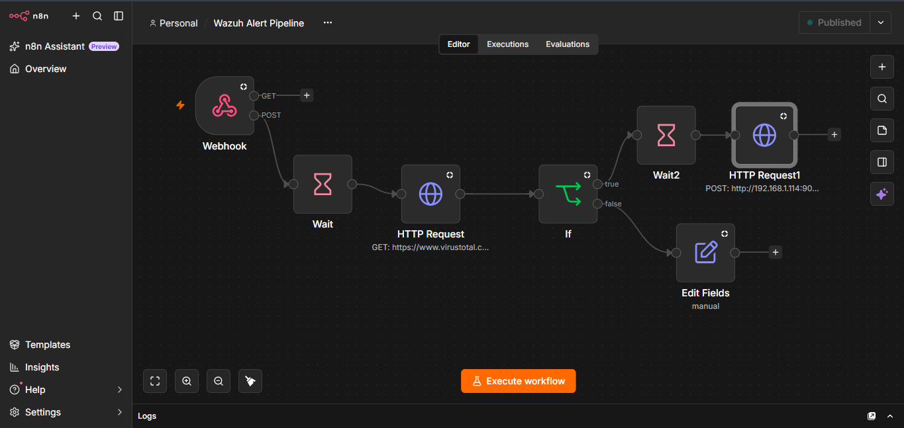
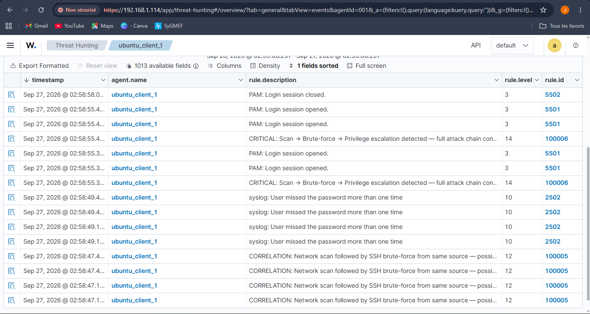
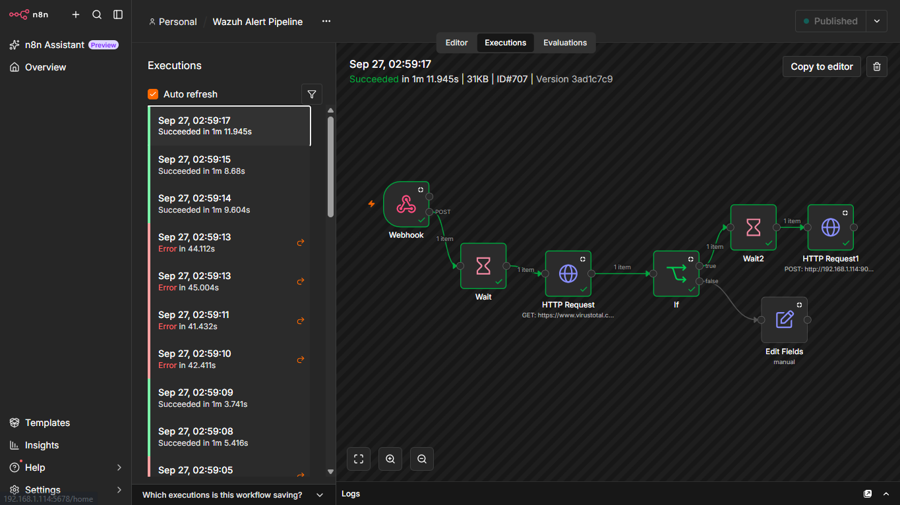
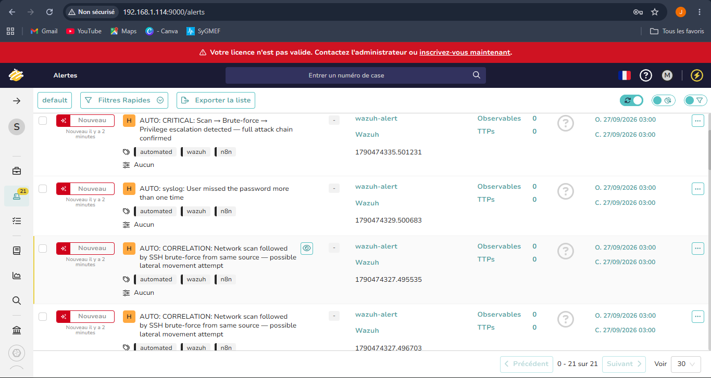

# Month 5 - Project 5.1 : Automated SOAR pipeline with n8n 

**Analyst:** Jean Mik C. TINIGO
**Date:** September 2026
**Difficulty:** Intermediate
**Tools:** Ubuntu Desktop 24.04, Ubuntu Server 22.04, Wazuh 4.14, TheHive 5.5, Cassandra 4.1.11, Elasticsearch 7.17.29, n8n 2.40.5

---

## Context & Objective
Every time Wazuh raises a level 12 alert, you manually perform the following steps: checking IOCs on VirusTotal, creating a case in TheHive, adding observables, and sending a notification. This takes an average of 15–20 minutes per alert. A SOC receiving 50 alerts a day loses 15 hours of analyst time to repetitive tasks. n8n automates this pipeline in under a minute.

Here is the workflow, 
```text
Wazuh alerte level >= 10
        │
        
n8n SOAR reçoit le webhook
        │
        |--> VirusTotal API  ->  IP/domain enrichment
        │
        |--> TheHive API     ->  Automatic alert creation
        │         |------->  add artefacts/observables

```

---

## Lab Architecture

| Component        | Role                        | OS                      | IP             |Resources|
|------------------|-----------------------------|-------------------------|----------------|---------|
| Ubuntu Server VM | Wazuh + n8n + TheHive server| Ubuntu 22.04 Server     | 192.168.1.114  |8GB of RAM; 3 cores|
| Ubuntu Desktop VM| Wazuh agent + target        | Ubuntu 24.04 Desktop    | 192.168.1.127  |5GB of RAM; 3 cores|
| Hypervisor       | Host                        | Oracle VirtualBox 7.2.4 | -              |-|

---

## n8n installation

n8n is a workflow automation platform that uniquely combines AI capabilities with business process automation, giving technical teams the flexibility of code with the speed of no-code.

For this lab we'll use it to automate a full automated SOAR pipeline

```bash
## ON UBUNTU SERVER

# Create a directory for n8n and move into it
mkdir n8n-server
cd n8n-server

# Create a directory for n8n data
mkdir n8n-data
sudo chown -R 1000:1000 n8n-data/
sudo chmod -R 755 n8n-data/

# Create a .env file 
sudo nano .env

```
```text
# n8n env file configuration
N8N_BASIC_AUTH_ACTIVE=true
N8N_BASIC_AUTH_USER=Your-User
N8N_BASIC_AUTH_PASSWORD=Your-Password
N8N_HOST=You-IP-Server
N8N_PORT=5678
N8N_PROTOCOL=http
N8N_SECURE_COOKIE=false  # Temporarily disable secure cookie to avoid HTTP access issues
NODE_ENV=production
```
Paste this by using your own information. 

```bash
# Create a docker compose file
sudo nano docker-compose.yml
```

```text
### docker-compose file
services:
  n8n:
    image: n8nio/n8n
    restart: always
    container_name: n8n-server  # Custom container name
    ports:
      - "5678:5678"
    env_file:
      - .env
    volumes:
      - ./n8n-data:/home/node/.n8n

```
Paste this and then start the container.
```bash
# start the container 
docker compose up -d

# Show the running container
docker compose ps 
```
When it start running , connect to the dashboard with your credentials by using the server ip followed with the port `5678`.
Like : `http://192.168.1.114:5678`
For this lab we need Wazuh and Thehive (he need Cassandra ans opensearch to be running too) running at the same time as n8n.

--- 

## Connect Wazuh with n8n

On your n8n dashboard, you will create a new workflow, name it `Wazuh Alert Pipeline` and add a `Webhook` Node , double click on it and copy the `production` link not the `test` one because the test link only listen for a few seconds and stop. We will edit the wazuh config file to connect with the webhook.

**NB: This Webhook node is the start point of our workflow. You just need to create it copy the permanent link, NO other configuration is needed here.**

```bash
## ON UBUNTU SERVER
sudo nano /var/ossec/etc/ossec.conf
```
And paste this on the last `ossec_config` variable on the bottom
```xml
<integration>
  <name>custom-n8n</name>
  <hook_url>[your-n8n-webhook-permanent-link]</hook_url>
  <level>10</level>
  <alert_format>json</alert_format>
</integration>

```

**NB: Be carefull with your the `name` value. Wazuh does not accept just any integration name. The allowed names are: `slack, pagerduty, virustotal, shuffle, maltiverse`, or any name starting with `custom-`. Wazuh rejects the integration without the `custom-` prefix if the not does belong to the allowed ones.**

So the next step are mandatory for the integration. The Wazuh integrator module looks for a script or binary with that name in `/var/ossec/integrations/`. Without this file, Wazuh does nothing, even if the webhook URL is correct.

So we're gonna copy and rename the file of one those allowed names and using it. **The names need be the same for working**.

```bash
# Copy the Shuffle one file integartions and rename it for custom-n8n
sudo cp /var/ossec/integrations/shuffle /var/ossec/integrations/custom-n8n
sudo cp /var/ossec/integrations/shuffle.py /var/ossec/integrations/custom-n8n.py

# Give those file the right permissions 
sudo chmod +x /var/ossec/integrations/custom-n8n /var/ossec/integrations/custom-n8n.py

# Give those file the right owners
sudo chown root:wazuh /var/ossec/integrations/custom-n8n
```

```bash
## ON UBUNTU SERVER
# restart wazuh manager service
sudo systemctl restart wazuh-manager
```

---

## Get your api key from TheHive 

Later on this lab we'll need TheHive api key to send him request for creating an alert. So connect to your dashboard on TheHive -> Click on your profile -> Settings -> APi key -> Generate . 

Copy it and save it for later. 

---

## Let's build the workflow 

For the webhook node we created recently you can select the http method you want, for this lab the `POST` method is `mandatory`. And in the `Settings` section, i enable `Always Output Data` (I do this for every single one of them, it help for debug).

- **Wait Node from the Webhook POST output :**
Create a `Wait` node from the Webhook POST output with theses options : 
  - Resume : After time interval
  - Wait Amount : 20.00
  - Wait Unit : Seconds

Wazuh usually generate many alerts but the next section is gonna be virustotal enrichment. For the previous lab we know the boundaries set on free virustotal api key (4 lookups/min; 500 lookups/day). So to prevent any error, we'll use this delay of 20 seconds for each alert receving by n8n webhook node.

- **Virustotal Enrichment :**
From the `Wait` node, we'll connect a `HTTP Request` node that will verify the source ip address of the alert on virustotal. Here is the options :
  - Method : GET
  - URL : https://www.virustotal.com/api/v3/ip_addresses/ {{ $('Webhook').item.json.body.all_fields.data.srcip }}
  - Authentication : Generic Credential Type
  - Generic Auth type : Header Auth
  - Header Auth : 
    - Name : x-apikey
    - Value : [your-virustotal-apikey]
    **NB: Here don't forget to changes the name of this header auth to Virustotal Header Auth. It's important to avoid error later.**

- **Condition (filtering) :**
From Virustotal Enrichment response we'll filter the result. A `if` node will be add to verify the result malicious value. If it's greater than zero we continue with TheHive but in other case we log "clean IP" and stop. For his options :
 - Condition : {{ $json.data.attributes.last_analysis_stats.malicious }}
 - `#` : is greater than
 -  : 0

- **Log and stop :**
From the false condition output, connect a `Edit fields` node. This node add some information that will be helpfull for debugging. Here is the options :
 - Mode : Manual Mapping
 - Fields to set : (Name : Value)
    - status : clean
    - message : IP {{ $('Webhook').item.json.body.all_fields.data.srcip }} is clean, no action needed
    - malicious_count : {{ $json.data.attributes.last_analysis_stats.malicious }}
    - timestamps : {{ $now }}

That it, he will add theses information to the output for needed debugging. 

- **Add another Wait node**
From the condition `true` output add a new wait node of 20 seconds, i don't think thehive api key has some limitations like virustotal but to prevent an error like `too much request` i add this. 

- **Create an alert on Thehive :**
Add a new `HTTP Request` node to the previous wait node. This one will use a post http method to create an alert on thehive using the apikex we generate earlier. Here are the options : 
  - Method : POST
  - URL : http://192.168.1.114:9000/api/v1/alert
  - Authentication : Generic Credential Type
  - Generic Auth type : Header Auth
  - Header Auth : 
    - Name : Authorization
    - Value : bearer [your-thehive-apikey]
    **NB: For the value field , you need to write `bearer` + ` ` (space) before putting your apikey from thehive**
    **NB: Here don't forget to changes the name of this header auth to TheHive Header Auth. It's important to avoid error later.**

  Enable `send Headers` button and use theses options :
  - Specific Headers : Using Fields Below 
  - Name : Content-type
  - Value : application\json

  Enable `send Body` button and use theses options :
  - Body Content Type : Using JSON 
  - Specify Body : JSON
  - JSON : 
  ```json
    {
      "title": "AUTO: {{ $('Webhook').item.json.body.all_fields.rule.description }}",
      "description": "Automated alert from Wazuh level {{ $('Webhook').item.json.body.all_fields.rule.level }}\n\nAgent: {{ $('Webhook').item.json.body.all_fields.agent.name }}\nSource IP: {{ $('Webhook').item.json.body.all_fields.data.srcip }}\nVT Malicious: {{ $('HTTP Request').item.json.data.attributes.last_analysis_stats.malicious }}",
      "sourceRef": "{{ $('Webhook').item.json.body.id }}",
      "severity": 3,
      "type": "wazuh-alert",
      "source": "Wazuh",
      "tags": ["automated", "wazuh", "n8n"],
      "tlp": 2,
      "artifacts": [
        {
          "dataType": "ip",
          "data": "{{ $('Webhook').item.json.body.all_fields.data.srcip }}",
          "message": "Attacker IP : auto-added by n8n",
          "tlp": 2,
          "tags": ["attacker", "automated"]
        }
      ]
    }
  ```

  This JSON body above will create all the information needed in our alert on TheHive.


Then click the `Publish` button on top right. Here we go , our workflow is ready to use. He will look like this : 

**Screenshot - Wazuh Alert Pipeline Workflow :**


---

## Test end-to-end

```bash
## ON UBUNTU SERVER

# Phase 1 - Scan
nmap -sS -T4 192.168.1.127

sleep 30

# Phase 2 - Brute-force SSH
echo -e "12345\npassword\nadmin\nqwerty\n1234567\nletmein\nwelcome\nmonkey\npassword123\n123456" > passwords.txt

hydra -l root -P ~/passwords.txt ssh://192.168.1.127 -t 4

## These two trigger a level 12 alert on wazuh

# Phase 3 - Connection to root 
## ON UBUNTU DESKTOP 

sudo su 
exit

# These three trigger a level 14 alert 

```

Let's see the result :

- **Wazuh :**

Wazuh show all three alert and their results : 

**Screenshot - Wazuh trigger level 10, 12 and 14 alert :**


- **n8n :**

n8n receive every alert an execute all the workflow , we can see some of the executions failed (by checking the problem, I understand it was due to a temporary DNS issue) but many succeed. The webhook receive every wazuh alert greater or equal than level 10 -> wait 20 seconds -> check the source ip on virustotal using our apikey -> verify from the result if the source ip malicious note is greater than 0 -> wait 20 seconds again -> create an alert of that on TheHive using our apikey. All nodes succeed.

**Screenshot - n8n workflow succeed :**


- **TheHive :**

We can see on the screenshot that 21 alerts is created and are actually related to wazuh events and n8n automation by the tags. This confirm a hundred success of the workflow.

**Screenshot - TheHive alerts :**



We can the total pipeline duration on n8n : 
Total pipeline duration: < 80 seconds 
Equivalent manual duration: 10–15 minutes

---

## Comparison of manual vs. automated time

Automated time is far more lower than the manual one. This can significantly reduce the amount of time a SOC analyst use to threat an alert. Allow him to put more time and concentration in the work that matters and avoid repetitive task.

---

## MITRE ATT&CK Coverage

| Technique ID | Name | Evidence in lab |
|---|---|---|
| T1059.003 | Windows Command Shell | Automated detection via Wazuh -> n8n pipeline |
| T1110.001 | Brute Force: Password Guessing | SSH brute-force triggers level 12 -> TheHive alert auto-created |
| T1595.001 | Active Scanning | Nmap scan triggers level 5 -> pipeline enrichment |
| T1078 | Valid Accounts | sudo escalation triggers level 14 -> alert auto-created |

---

## Challenges and Lessons Learned

-  **Shuffle need too much resources :**
My first plan is to use Shuffle for this lab, Shuffle is far more dedicaced SOAR tool to use in a SOC. It's design for it. Unfortunatly, after i install it from docker on my ubuntu server, i realize that i can't run it at time that Wazuh and TheHive due to my lack of resources. 
I tried so many trick like reducing the resources consuming by all three tool to see if they can run together but nothing work.
So i choose n8n know as an automation tool and move forward with it.

- **Reduce cassandra, elasticsearch consuming resources -Xmx, -Xms :**
During my desesperate manipulation to run Shuffle, wazuh, TheHive at the same time, i discover that i can reduce the resources consuming by `Cassandra` + `elasticsearch`. Reducing their resources not affect their operation. To lower them i use this : 
```bash
## ELASTICSEARCH
# To see what actual resources is tuning
sudo grep -rn "Xms\|Xmx" /etc/elasticsearch/

# Use these commands to comment these lines and creat an override with lower resources allowed
sudo sed -i 's/^-Xms4g/#-Xms4g/' /etc/elasticsearch/jvm.options.d/jvm.options
sudo sed -i 's/^-Xmx4g/#-Xmx4g/' /etc/elasticsearch/jvm.options.d/jvm.options

# Create an override with lower resources 
sudo nano /etc/elasticsearch/jvm.options.d/heap.options
```
Paste this in the file 
```text
-Xms1g
-Xmx1g
-XX:MaxDirectMemorySize=512m
```

```bash

# restart the service
sudo systemctl restart elasticsearch


## CASSANDRA
# Go to this config file
sudo nano /etc/cassandra/cassandra-env.sh

# Decomment these variables and put them this values 
MAX_HEAP_SIZE="1G"
HEAP_NEWSIZE="256M"

# restart the service 
sudo systemctl restart cassandra

# you need to restart thehiver service too 
sudo systemctl restart thehive

```

I recommend this order, it works for me :
```bash
# 1. Stop everything
sudo systemctl stop thehive
sudo systemctl stop elasticsearch
sudo systemctl stop cassandra

# 2. Restart in the correct order
sudo systemctl start cassandra
sleep 20  # Allow Cassandra to initialize
sudo systemctl start elasticsearch
sleep 15  # Allow Elasticsearch to initialize
sudo systemctl start thehive
```


- **Changing wazuh indexer port from 9200 to 9201 :**
My first time i run all three services (Wazuh + n8n + TheHive) i can connect successfully to n8n and TheHive but Wazuh put an error saying "The dashboard is not ready yet". After verify all three wazuh services (wazuh-manager, wazuh-indexer, wazuh-dashboard) by using `sudo systemctl status <wazuh-service-name>` i realize that `wazuh-indexer` show some error.
I realize that he and elasticsearch need port `9200` to run properly. And if i can connect to TheHive, he 's probably the ones using that port actually . 

So i decide to changes the wazuh-indexer port from `9200` to `9201`.

For this process, four file are configured :
  - wazuh-manager : Go to the config file `sudo nano /var/ossec/etc/ossec.conf`, search for `9200` and changes the value to `9201`
  - wazuh-indexer : Go to the config file `sudo nano /etc/wazuh-indexer/opensearch.yml` and write this `http.port: 9201` on the second line
  - wazuh-dashboard : Go to the config file `sudo nano /etc/wazuh-dashboard/opensearch_dashboards.yml`, search for `9200` and change it to `9201`
  - filebeat : Go to the config file `/etc/filebeat/filebeat.yml`, search for `127.0.0.1:9200`, change it to `127.0.0.1:9201` and test with `sudo filebeat test output`

  Now you need to restart all four services and wazuh will work perfectly.


- **An SOC analyst should not create direct case from raw alert :**
My first planning with Shuffle SOAR was to create an case from avery alert and then use this case id to create the observables (IOCs). It will use two http request : the first for creating the case and the second to put the observables in it. 
But after changing my stack (Go from Shuffle to n8n) and do more research, i understand that a SOAR pipeline should not create direct case from a raw alert. We don't even sure if it's not a false positive. 
So i choose another approach, create an alert instead of a case and put the IOCs on the alert description.
And Normally from that a SOC analyst L1/L2 should triage these alerts and choose which need to open a case.
 

- **Create a specific header auth in n8n :**
During my first attempt of the workflow pipeline i use the same name for the Header Authentication method in my `HTTP Request` node, remember that i have one for `virustotal enrichment` and the other one for `TheHive alert`. But they use different header authentication variables (name, value).
And every time i change the value for one the other one changes automatically because they have the same names creating a kind of looping authentication error, if one succeed the other fail again and again.
So i found the solution by creating a specific names for each header authentication `Virustotal Header Auth` and `TheHive Header Auth`. n8n allow us to create a new credential in the `Header Auth` field and we can identify them by write the names we want.

- **Replace the virustotal http request get URL value :**
For this lab the source ip port for all alert will be `192.168.1.114` because i launch the attack commands from the ubuntu server machine. This ip can't be malicious on virustotal and i can't verify if the `true` result from the `condition` node work.
To fix that, i temporarly changes the virustotal http get request url to this : `https://www.virustotal.com/api/v3/ip_addresses/45.131.214.85`.

Yes that's the malicious ip address from month 1 pcap analysis for NetSupport RAT malware. and yes he's malicious and work perfectly fine. 

---

## Resources Used

- [MITRE ATT&CK](https://attack.mitre.org)
- [Shuffle github installation guide](https://github.com/Shuffle/Shuffle/blob/main/.github/install-guide.md)
- [Shuffle Configuration Documentation](https://shuffler.io/docs/configuration)
- [n8n github source](https://github.com/n8n-io/n8n)
- [n8n io documention](https://docs.n8n.io/deploy/host-n8n/install-options/install-using-docker-compose)
